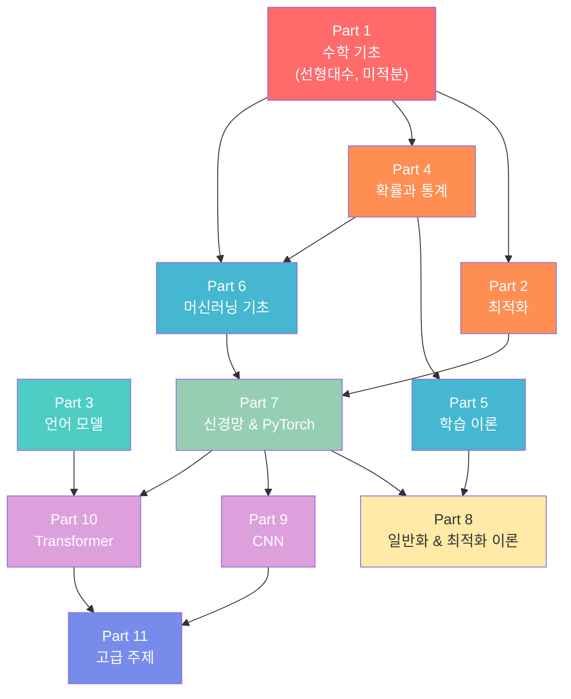

# 딥러닝 학습 로드맵

> **과목**: 딥러닝 (이성윤 교수님)
> **목표**: A+ 취득
> **전제**: 수학 기초 없음 → 처음부터 차근차근

---

## 1. 전체 강의 구조 개요

이 강의는 **수학 기초 → 최적화 → 확률/통계 → 머신러닝 → 딥러닝 → 응용**의 흐름으로 구성되어 있다.
총 11개 파트, 약 640페이지 분량이며, 크게 세 블록으로 나눌 수 있다.

| 블록 | 파트 | 범위 | 핵심 내용 | 성격 |
|------|------|------|-----------|------|
| **기반 수학** | Part 1~2 | p.32-130 | 선형대수, 미적분, 최적화 | 도구 |
| **이론 프레임워크** | Part 3~6 | p.130-330 | 확률, 학습이론, ML 기초 | 개념 |
| **딥러닝 본론** | Part 7~11 | p.330-670 | 신경망, CNN, Transformer, 생성모델 | 실전 |

### 각 파트 요약

| 파트 | 페이지 | 제목 | 한 줄 요약 |
|------|--------|------|-----------|
| Part 1 | p.32-100 | 수학 기초 | 집합, 함수, 벡터, 행렬, SVD, 미분 — 딥러닝의 언어를 배운다 |
| Part 2 | p.100-130 | 최적화 | 제약 최적화, softmax 유도, 동역학계 — 학습이 "왜 되는지"의 첫 단추 |
| Part 3 | p.130-150 | 언어 모델 | Next-Token Prediction — 현대 AI의 핵심 아이디어를 일찍 맛본다 |
| Part 4 | p.150-210 | 확률과 통계 | 베이즈, 분포, CLT — 불확실성을 다루는 법 |
| Part 5 | p.210-260 | 학습 이론 | 일반화, double descent, bias-variance — "왜 학습이 되는가" |
| Part 6 | p.260-330 | 머신러닝 기초 | 분류, 회귀, LDA — 신경망 이전의 고전적 방법론 |
| Part 7 | p.330-400 | 신경망 | 2-layer NN, GD/SGD, 역전파, PyTorch — 드디어 딥러닝 시작 |
| Part 8 | p.400-460 | 일반화 & 최적화 이론 | estimation error, flat minima — 이론적 깊이 |
| Part 9 | p.460-510 | CNN | 합성곱, 이미지 처리 — 컴퓨터 비전의 기초 |
| Part 10 | p.510-570 | 시퀀스 모델 & 트랜스포머 | RNN, attention, transformer — NLP와 현대 AI의 심장 |
| Part 11 | p.570-670 | 고급 주제 | VAE, diffusion, self-supervised learning — 최신 연구 동향 |

---

## 2. 학습 순서와 의존 관계

### 의존 관계 다이어그램



### 의존 관계 해석

- **Part 1은 절대적 선수과목**: Part 2, 4, 6이 모두 Part 1에 의존한다. 여기를 대충 넘기면 전체가 무너진다.
- **두 갈래 흐름**: Part 1에서 (1) 최적화 → 신경망 경로와 (2) 확률 → 학습이론 경로가 갈라진다.
- **Part 7이 합류 지점**: 두 갈래가 Part 7 (신경망)에서 만나고, 이후 CNN/Transformer/고급 주제로 확장된다.
- **Part 3은 독립적**: 언어 모델은 비교적 가볍게 읽고, Part 10에서 다시 연결된다.

### 권장 학습 순서

```
1단계: Part 1 (수학 기초) ─────────────────── [최우선, 절대 건너뛰지 말 것]
2단계: Part 2 (최적화) + Part 4 (확률/통계) ─ [병행 가능]
3단계: Part 3 (언어 모델) ─────────────────── [가볍게 읽기]
4단계: Part 5 (학습 이론) + Part 6 (ML 기초)  [병행 가능]
5단계: Part 7 (신경망) ────────────────────── [핵심! 실습 필수]
6단계: Part 8 (일반화/최적화 이론) ──────────── [이론 심화]
7단계: Part 9 (CNN) + Part 10 (Transformer) ─ [병행 가능]
8단계: Part 11 (고급 주제) ────────────────── [마무리]
```

---

## 3. 각 챕터별 예상 학습 시간

| 파트 | 페이지 수 | 난이도 | 1회독 | 복습 포함 총 시간 | 비고 |
|------|-----------|--------|-------|------------------|------|
| Part 1 | ~68p | ★★★★★ | 12시간 | **20시간** | 수학 기초 없으면 여기가 가장 오래 걸림 |
| Part 2 | ~30p | ★★★★☆ | 5시간 | **8시간** | 라그랑주 승수법이 핵심 |
| Part 3 | ~20p | ★★☆☆☆ | 2시간 | **3시간** | 개념 중심, 비교적 가벼움 |
| Part 4 | ~60p | ★★★★☆ | 8시간 | **13시간** | 확률은 반복이 답 |
| Part 5 | ~50p | ★★★★☆ | 6시간 | **10시간** | 추상적이라 어려울 수 있음 |
| Part 6 | ~70p | ★★★☆☆ | 7시간 | **11시간** | 비교적 직관적 |
| Part 7 | ~70p | ★★★★☆ | 8시간 | **14시간** | PyTorch 실습 시간 포함 |
| Part 8 | ~60p | ★★★★★ | 7시간 | **12시간** | 이론 난이도 최고 구간 |
| Part 9 | ~50p | ★★★☆☆ | 5시간 | **8시간** | 시각적이라 이해하기 편함 |
| Part 10 | ~60p | ★★★★☆ | 7시간 | **12시간** | Attention 메커니즘이 핵심 |
| Part 11 | ~100p | ★★★★☆ | 10시간 | **15시간** | 범위 넓지만 깊이는 중간 |
| **합계** | **~638p** | | **77시간** | **~126시간** | |

> **현실적 계획**: 하루 2시간씩 공부하면 약 9주, 하루 3시간이면 약 6주 소요.
> 시험 전 집중 복습 2주를 더하면 총 8~11주가 필요하다.

---

## 4. 학습 전략: 수학 기초가 없는 학생을 위한 가이드

### 4.1 마인드셋

> "수학을 못하는 게 아니라, 아직 안 배운 것이다."

이 강의의 좋은 점은 Part 1에서 필요한 수학을 직접 가르쳐준다는 것이다.
고등학교 수학도 기억 안 나도 괜찮다. 다만 **Part 1에 충분한 시간을 투자해야** 한다.

### 4.2 Part 1 (수학 기초) 공략법

이 파트가 전체 학습의 성패를 결정한다. 아래 순서를 따르자.

1. **집합과 함수**: 기호에 익숙해지는 것이 목표. 정의를 외우기보다 예시를 많이 보자.
2. **벡터와 행렬**: 손으로 직접 계산해본다. 2x2, 3x3 행렬로 연습.
3. **고유값과 SVD**: 기하학적 의미를 먼저 이해한다 ("행렬은 공간을 변환한다").
   - 추천 자료: 3Blue1Brown "Essence of Linear Algebra" (한글 자막 있음)
4. **미적분**: chain rule이 핵심. 합성함수 미분을 자유자재로 할 수 있어야 한다.
5. **행렬 미분**: 가장 생소할 수 있지만, 패턴을 외우면 된다. 공식표를 만들어서 활용하자.

### 4.3 각 파트별 핵심 학습법

| 파트 | 학습법 |
|------|--------|
| Part 1 | 손 계산 필수. 공식 유도를 직접 따라 써본다. |
| Part 2 | softmax 유도 과정을 처음부터 끝까지 재현할 수 있어야 한다. |
| Part 3 | 큰 그림만 잡는다. "왜 next-token prediction이 강력한가?" |
| Part 4 | 조건부확률과 베이즈 정리를 문제로 반복 연습. |
| Part 5 | bias-variance tradeoff 그래프를 직접 그려보고 설명할 수 있어야 한다. |
| Part 6 | 각 알고리즘의 목적함수(loss function)를 정리한다. |
| Part 7 | **PyTorch 코드를 직접 실행**한다. 역전파를 손으로 한 번은 계산해본다. |
| Part 8 | 정리(theorem)의 의미를 자기 말로 바꿔 쓴다. 증명은 흐름만 파악. |
| Part 9 | 합성곱 연산을 작은 예제로 직접 계산. 필터 크기/stride/padding 관계 정리. |
| Part 10 | Attention 수식을 단계별로 분해. "Attention Is All You Need" 핵심 그림 암기. |
| Part 11 | 각 생성 모델(VAE, Diffusion)의 핵심 아이디어를 한 문장으로 요약. |

### 4.4 효과적인 노트 정리법

1. **개념 카드 만들기**: 앞면에 용어/수식, 뒷면에 직관적 설명과 예시
2. **공식 유도 노트**: 중요한 수식 유도를 빈칸 없이 처음부터 끝까지 적어본다
3. **연결 지도**: 챕터 간 개념이 어떻게 연결되는지 화살표로 그린다
4. **오답 노트**: 틀린 문제와 헷갈린 개념을 모아둔다

### 4.5 보충 자료 (수학 기초가 없는 학생에게 강력 추천)

| 주제 | 자료 | 형태 |
|------|------|------|
| 선형대수 직관 | 3Blue1Brown - Essence of Linear Algebra | 유튜브 (한글 자막) |
| 미적분 직관 | 3Blue1Brown - Essence of Calculus | 유튜브 (한글 자막) |
| 확률/통계 | StatQuest with Josh Starmer | 유튜브 |
| 딥러닝 전반 | Andrew Ng - Deep Learning Specialization | Coursera |
| PyTorch 실습 | PyTorch 공식 튜토리얼 (60분 블리츠) | 웹사이트 |

---

## 5. 시험 대비 전략

### 5.1 시험 유형 예상

이성윤 교수님 강의 특성상 다음 유형이 출제될 가능성이 높다:

- **수식 유도**: softmax 유도, 역전파 계산, SVD 활용 등
- **개념 서술**: "왜 double descent가 발생하는가?", "flat minima의 의미는?" 등
- **계산 문제**: 행렬 연산, 편미분, 확률 계산
- **코드 해석/작성**: PyTorch 코드 빈칸 채우기 또는 출력 예측

### 5.2 시험 준비 타임라인

```
[시험 4주 전] 전체 내용 1회독 완료 목표
[시험 3주 전] 핵심 수식/유도 정리 + 약한 파트 집중 복습
[시험 2주 전] 예상 문제 만들어서 풀기 + 오답 분석
[시험 1주 전] 공식 정리표 반복 + 핵심 유도 과정 빈칸 테스트
[시험 전날]   공식 정리표 최종 확인 + 일찍 자기
```

### 5.3 반드시 암기/체화해야 할 것들

#### 수식 유도 (직접 유도할 수 있어야 함)
- [ ] softmax 함수 유도 (제약 최적화에서)
- [ ] 역전파 알고리즘 (chain rule 적용)
- [ ] 최소제곱법 정규 방정식 유도
- [ ] 베이즈 정리 활용한 사후확률 계산
- [ ] Attention score 계산 과정

#### 개념 (자기 말로 설명할 수 있어야 함)
- [ ] 고유값/고유벡터의 기하학적 의미
- [ ] SVD의 의미와 활용
- [ ] bias-variance tradeoff
- [ ] double descent 현상
- [ ] gradient descent vs SGD 차이와 장단점
- [ ] CNN에서 합성곱의 역할
- [ ] self-attention이 RNN보다 나은 이유
- [ ] VAE의 ELBO
- [ ] diffusion model의 forward/reverse process

#### 코드 (빈칸 채우기 대비)
- [ ] PyTorch로 2-layer NN 구현
- [ ] loss.backward() → optimizer.step() 흐름
- [ ] CNN 모델 정의 (nn.Conv2d, nn.MaxPool2d)
- [ ] Transformer의 attention 구현

### 5.4 점수를 올리는 실전 팁

1. **부분 점수를 노려라**: 모르는 문제도 아는 것부터 적는다. 수식 유도 문제에서 첫 3줄만 맞아도 부분 점수를 받을 수 있다.
2. **기호를 정확하게**: 벡터는 볼드체, 전치는 T 위첨자 등 수학 표기법을 정확히 써야 감점을 피한다.
3. **차원을 항상 체크**: 행렬 곱셈에서 차원이 맞는지 옆에 적어두면 실수를 줄일 수 있다.
4. **시간 배분**: 전체 문제를 먼저 훑고, 쉬운 문제부터 푼다. 어려운 유도 문제에 시간을 다 쓰지 말 것.

---

## 마무리

수학 기초가 없어도 A+는 충분히 가능하다. 핵심은 세 가지다:

1. **Part 1에 충분한 시간을 투자할 것** — 여기가 기초 공사다
2. **손으로 직접 계산하고 유도할 것** — 눈으로 읽는 것과 직접 쓰는 것은 다르다
3. **꾸준히, 매일 조금씩** — 벼락치기로는 이 과목을 이길 수 없다

이 로드맵을 따라가면서, 각 파트를 공부할 때마다 `study_renew/` 폴더에 정리 노트를 만들어가자.
한 챕터씩 정복할 때마다 체크 표시를 하면 성취감이 쌓일 것이다. 화이팅!
