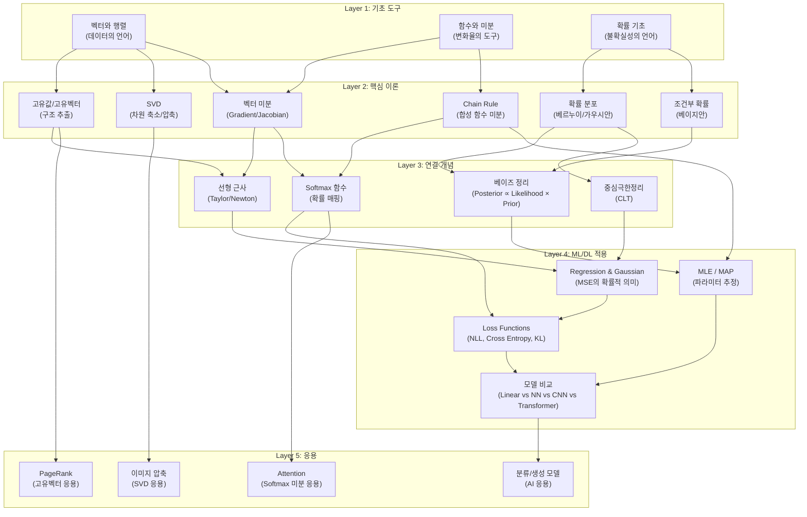
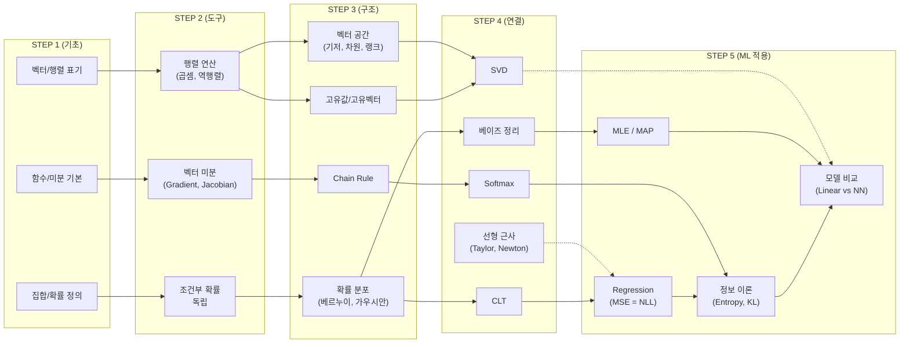

# 딥러닝 수학 기초 종합 학습 지도

> **범위**: 2~4주차 (선행영상 + 수업) 마인드맵 8장 종합
> **목적**: "무엇을 → 왜 → 어떤 순서로 → 어떻게" 배워야 하는지의 지도
> **활용법**: 이 문서를 먼저 읽고, 세부 학습 계획을 세울 때 참조

---

## 1. 이 마인드맵들이 말하고자 하는 것 (핵심 메시지)

이 8장의 마인드맵은 하나의 이야기를 전달한다:

> **"딥러닝은 결국 수학이다. 선형대수로 데이터를 표현하고, 미분으로 최적화하고, 확률로 불확실성을 다룬다. 이 세 기둥이 만나는 곳에 신경망이 있다."**

### 세 기둥의 역할

| 기둥 | 역할 | 딥러닝에서의 의미 |
|------|------|-----------------|
| **선형대수** | 데이터의 표현과 변환 | 신경망의 각 층은 행렬 곱셈 = 선형 변환 |
| **미분/최적화** | 학습의 메커니즘 | Gradient Descent로 손실을 줄여나가는 과정 |
| **확률/통계** | 불확실성의 모델링 | 왜 이 Loss를 쓰는지, 왜 이 분포를 가정하는지 |

---

## 2. 전체 개념 관계도 (Knowledge Map)



---

## 3. 주차별 상세 내용 분해

### 3.1 Week 2: 선형대수 + 미분 기초

**선행영상이 가르치는 것**: "행렬은 숫자 격자가 아니라 **변환 장치**다"

#### 선형대수 파트

| 개념 | 핵심 한 줄 | 딥러닝 연결 |
|------|----------|-----------|
| 벡터 표기법 | 컬럼 스택(수직), 세미콜론(수평) | 데이터 포인트 = 벡터 |
| 내적 (Inner Product) | 두 벡터의 유사도 측정 | Attention score의 기반 |
| 행렬 곱셈 | O(n³) 복잡도, 역행렬도 비쌈 | 신경망 forward pass의 핵심 연산 |
| 선형 결합 / 스팬 | 벡터들로 만들 수 있는 모든 점의 집합 | 모델의 표현 가능한 함수 공간 |
| 선형 독립 | 중복 없는 정보의 최소 단위 | 특성(feature)의 유용성 판단 |
| 기저 / 차원 | 공간을 설명하는 최소 벡터 집합 | 차원 축소의 이론적 근거 |

#### 고유값/고유벡터 → SVD

| 개념 | 핵심 한 줄 | 왜 중요한가 |
|------|----------|-----------|
| Av = λv | 변환해도 방향이 안 바뀌는 특별한 벡터 | 시스템의 "본질적 방향" 추출 |
| 고유값 (λ) | 그 방향의 중요도/크기 비율 | 큰 고유값 = 중요한 방향 |
| SVD | 모든 행렬을 3개로 분해 (U·Σ·V^T) | 데이터 압축, PCA, 추천시스템 |
| PageRank | 웹을 거대 행렬로 보고 주요 고유벡터 추출 | 고유벡터의 실세계 킬러 앱 |

#### 미분 기초

| 개념 | 핵심 한 줄 | 딥러닝 연결 |
|------|----------|-----------|
| 선형 근사 (Taylor) | 복잡한 함수를 1차 함수로 흉내내기 | Newton's method, 최적화의 철학 |
| 벡터-스칼라 미분 | 각 성분별 편미분 = Component-wise | 가장 기본적 미분 |
| 스칼라-벡터 미분 | 결과가 **Gradient** (∇, 나블라) | Loss의 그래디언트 = 학습 방향 |
| 벡터-벡터 미분 | 결과가 **Jacobian 행렬** | Chain rule의 행렬 표현 |

---

### 3.2 Week 3: 확률 이론 + Softmax

**선행영상이 가르치는 것**: "확률은 '모르는 것'을 다루는 수학이다"

#### 확률 기초

| 개념 | 정의 | 왜 배우는가 |
|------|------|-----------|
| 실험 (Experiment) | 아웃컴을 내뱉는 과정 | 데이터 생성 과정의 추상화 |
| 샘플 스페이스 (S) | 가능한 모든 결과의 집합 | 전체 가능성의 범위 설정 |
| 이벤트 (E) | S의 부분집합 | "관심 있는 결과"를 정의 |
| 확률 분포 P(s) | 각 결과에 확률 배정 | 데이터의 패턴을 수학으로 |

#### 확률 측도와 독립

| 개념 | 공식 | 직관 |
|------|------|------|
| 라플라스 정의 | P(E) = |E|/|S| | 동일 확률 가정 시 "경우의 수" |
| 조건부 확률 | P(E\|F) = P(E∩F)/P(F) | "F가 일어났을 때 E의 확률" |
| 독립 | P(E∩F) = P(E)·P(F) | 서로 영향 없음 |

#### 주요 분포

| 분포 | 특징 | 딥러닝 연결 |
|------|------|-----------|
| **베르누이** | 0 or 1, 파라미터 θ 하나 | 이진 분류의 기본 모델 |
| **가우시안** | exp(-x²) 형태, 종 모양 | 노이즈 모델링, Regression의 근거 |

#### Softmax & Chain Rule

| 개념 | 역할 | 딥러닝 연결 |
|------|------|-----------|
| Softmax | 임의의 벡터 → 확률 분포 (0~1, 합=1) | 분류 모델의 마지막 층 |
| Softmax 미분 | Kronecker delta를 포함한 행렬 형태 | Backpropagation에서 필수 |
| Chain Rule | 합성 함수의 미분 = 행렬 곱의 연쇄 | **역전파 알고리즘의 수학적 본질** |

---

### 3.3 Week 3 수업: 베이지안 확률과 기계학습 기초

**수업이 가르치는 것**: "학습 = 데이터를 보고 믿음을 업데이트하는 과정"

#### 베이지안 관점

```
Prior (사전 믿음)  +  Data (관측)  →  Posterior (업데이트된 믿음)
     P(H)          P(E|H)              P(H|E)
```

이것이 **베이즈 정리**의 본질:
```
P(H|E) = [P(E|H) × P(H)] / P(E)
        = Likelihood × Prior / Evidence
```

#### MLE vs MAP

| | MLE | MAP |
|---|-----|-----|
| **최대화 대상** | P(Data\|θ) (Likelihood) | P(θ\|Data) ∝ P(Data\|θ)·P(θ) |
| **Prior 반영** | ✗ (Uniform Prior 가정) | ✓ |
| **데이터 적을 때** | 과적합 위험 ↑ | 사전 지식으로 방어 |
| **데이터 많을 때** | MLE ≈ MAP | Prior 영향 감소 |

---

### 3.4 Week 4: 머신러닝과 확률적 추론

**수업이 가르치는 것**: "모델 선택 = Prior(가정)의 선택이다"

#### 파라미터 추정 → 모델 비교 연결

```
MLE/MAP (파라미터 추정)
    ↓
어떤 모델에 적용하는가?
    ├─ Linear Model: 높은 Inductive Bias → 데이터 적을 때 유리
    ├─ Neural Network: 높은 Expressivity → 데이터 많을 때 유리
    ├─ CNN: 이미지 특화 Prior (공간 지역성)
    └─ Transformer: 낮은 Prior → 대량 데이터 필요
```

#### Regression과 Gaussian의 관계 (핵심 연결!)

이것은 매우 중요한 통찰이다:

```
노이즈가 Gaussian이라 가정 (CLT 근거)
    ↓
Likelihood = Gaussian = exp(-½(y-ŷ)²/σ²)
    ↓
Negative Log Likelihood = ½(y-ŷ)²/σ² + const
    ↓
∴ NLL 최소화 ≡ MSE 최소화
```

> **즉, MSE Loss를 쓰는 것은 "노이즈가 정규분포"라고 가정하는 것과 같다!**

#### 정보 이론 기초

| 개념 | 공식 | 직관 |
|------|------|------|
| Entropy H(P) | -Σ P(x)log P(x) | 분포 P의 불확실성 (정보량) |
| Cross Entropy H(P,Q) | -Σ P(x)log Q(x) | Q로 P를 설명하는 비용 |
| KL Divergence D(P‖Q) | Σ P(x)log[P(x)/Q(x)] | P와 Q의 "거리" (비대칭) |
| **관계** | H(P,Q) = H(P) + D(P‖Q) | Cross Entropy 최소화 ≈ KL 최소화 |

---

## 4. 개념 간 의존 관계 (학습 순서 가이드)

### 4.1 의존 관계 DAG



### 4.2 추천 학습 순서

| 순서 | 주제 | 예상 시간 | 선수 조건 | 확인 질문 |
|------|------|----------|----------|----------|
| ① | 벡터/행렬 표기와 연산 | 2h | 없음 | "내적이 뭐고 왜 쓰는가?" |
| ② | 벡터 공간 (기저, 차원, 랭크) | 2h | ① | "랭크가 뭐고 왜 중요한가?" |
| ③ | 고유값/고유벡터 | 2h | ①② | "Av=λv가 의미하는 바를 설명" |
| ④ | SVD | 1.5h | ③ | "이미지 압축에 SVD를 왜 쓰는가?" |
| ⑤ | 함수와 미분 기본 | 1.5h | 없음 | "편미분이 뭔가?" |
| ⑥ | 벡터 미분 (Gradient, Jacobian) | 2h | ①⑤ | "∇f가 왜 벡터인가?" |
| ⑦ | Chain Rule + 선형 근사 | 2h | ⑥ | "합성함수 미분을 행렬로 쓰면?" |
| ⑧ | Softmax와 그 미분 | 1.5h | ⑥⑦ | "Softmax 출력의 합이 왜 1인가?" |
| ⑨ | 확률 기초 (정의, 조건부, 독립) | 2h | 없음 | "P(A|B)와 P(B|A)의 차이?" |
| ⑩ | 확률 분포 (베르누이, 가우시안) | 1.5h | ⑨ | "가우시안의 exp(-x²)는 뭘 의미?" |
| ⑪ | 베이즈 정리 | 1.5h | ⑨⑩ | "Prior와 Posterior의 관계?" |
| ⑫ | MLE / MAP | 2h | ⑩⑪ | "MLE와 MAP의 차이와 트레이드오프?" |
| ⑬ | CLT + Regression과 Gaussian | 1.5h | ⑩⑫ | "MSE가 왜 NLL과 같은가?" |
| ⑭ | 정보 이론 (Entropy, CE, KL) | 2h | ⑩⑫ | "Cross Entropy Loss의 확률적 의미?" |
| ⑮ | 모델 비교 (Linear→NN→CNN→Transformer) | 2h | ⑫⑬⑭ | "CNN의 Inductive Bias란?" |

**총 예상: 약 27시간** (여유 포함 35시간)

---

## 5. 핵심 연결 고리 (이것을 이해하면 전체가 보인다)

### 연결 고리 1: "행렬 = 변환"
```
행렬 × 벡터 = 새로운 벡터
→ 신경망의 한 층 = 행렬 곱 + 비선형 활성화
→ 딥러닝 = 행렬 곱의 연쇄
```

### 연결 고리 2: "미분 = 학습 방향"
```
Loss(θ) → ∇Loss(θ) = "θ를 어디로 바꿔야 Loss가 줄까?"
→ Chain Rule로 각 층의 그래디언트를 역순으로 계산
→ 이것이 역전파(Backpropagation)
```

### 연결 고리 3: "Loss = 확률적 가정"
```
MSE Loss ← Gaussian 노이즈 가정 ← NLL 최소화
Cross Entropy Loss ← 베르누이/카테고리컬 가정 ← NLL 최소화
→ Loss 함수를 "선택"하는 것은 데이터의 확률 모델을 "가정"하는 것
```

### 연결 고리 4: "모델 = Prior의 강도"
```
Linear Model: 강한 Prior (직선만!) → 데이터 적어도 OK
CNN: 중간 Prior (공간 지역성) → 이미지에 특화
Transformer: 약한 Prior (거의 없음) → 데이터 많이 필요
Neural Network: Prior가 적을수록 Expressivity ↑, 데이터 요구량 ↑
```

---

## 6. 시험 대비 포인트 (4주차 마인드맵 기반)

- **시험 형식**: 퀴즈와 유사한 주관식
- **평가 요소**: 답 도출 **논리 과정** 서술 (답만 쓰면 감점)
- **시험 범위**: 4주차까지 배운 내용 전부
- **핵심**: 공식 암기보다 "왜 이 공식인가"를 설명할 수 있어야 함

### 출제 가능성 높은 토픽 (개인 분석)
1. MLE vs MAP 비교 + 구체적 계산
2. MSE와 Gaussian NLL의 동치 증명
3. Softmax 함수의 미분 유도
4. 베이즈 정리 적용 문제
5. 고유값/SVD의 의미와 응용

---

## 7. 마인드맵 소스 목록

| # | 파일 | 범위 | 언어 |
|---|------|------|------|
| 1 | 2주차 선행영상 EN | 선형대수 + AI/Google 수학 | 영어 |
| 2 | 2주차 선행영상 KR | 동일 내용 한국어 버전 | 한국어 |
| 3 | 3주차 선행영상 EN | 미분 + 확률 기초 | 영어 |
| 4 | 3주차 선행영상 KR | 동일 내용 한국어 버전 | 한국어 |
| 5 | 2주차 수업 EN | 선형대수 & 미분 심화 | 영어 |
| 6 | 2주차 수업 KR | 동일 내용 한국어 버전 | 한국어 |
| 7 | 3주차 수업 | 베이지안 확률 + ML 기초 | 한국어 |
| 8 | 4주차 수업 | ML + 확률적 추론 + 정보이론 | 한국어 |
