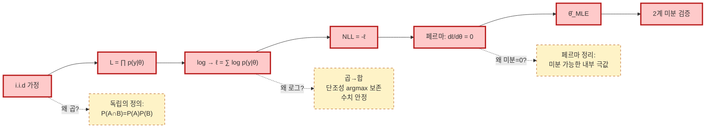
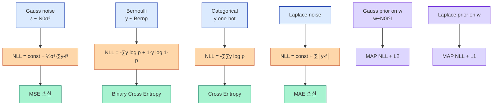
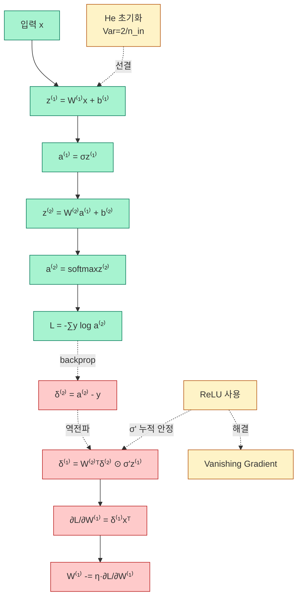
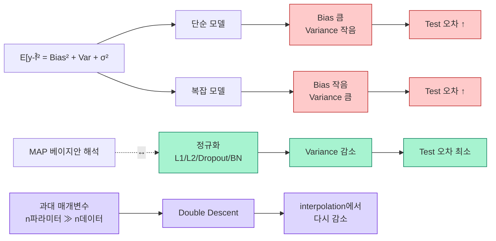
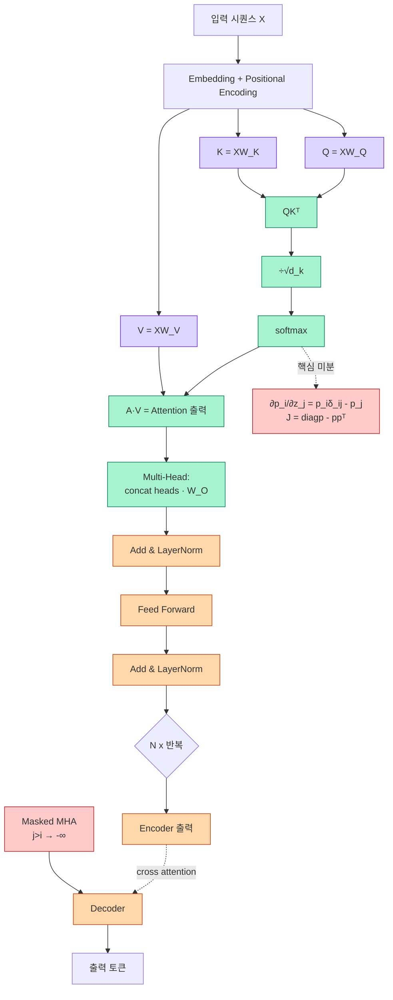
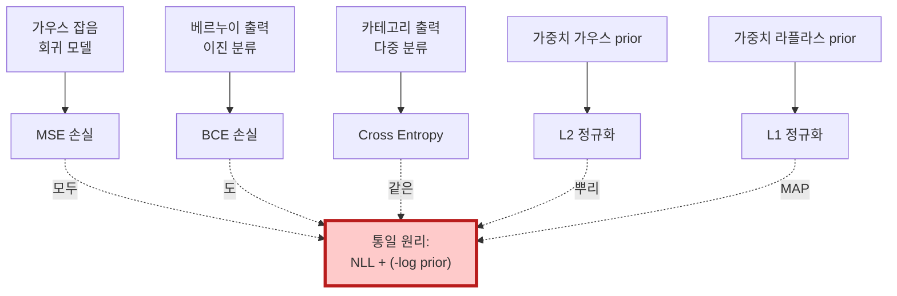
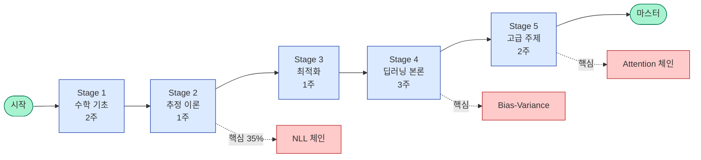

# 딥러닝 이론 학습 지도 — 순서·관계·응용

> **목적:** 742장 강의의 모든 핵심 개념을 **어떤 순서로** 배워야 하고, 각 개념이 **어디에서·어떻게·왜** 사용되는지를 보여주는 관계도.
>
> **사용법:** [`MASTER-CONCEPTS.md`](./MASTER-CONCEPTS.md)와 함께 사용. MASTER가 "무엇"을, 본 문서가 "언제·왜·어디로"를 답한다.

---

## 1. 학습 순서 — 5단계 코스

### Stage 1 — 수학 기초 (2주)
> "딥러닝의 절반은 선형대수, 미적분, 확률이다."

| 항목 | 핵심 산출물 |
|-----|-----------|
| 선형대수 | 행렬 곱·전치, 고유값/벡터, SVD, Spectral 정리 |
| 미적분 | 미분/적분, 체인 룰, 부분적분, 가우스 적분 √(2π) |
| 확률 | 분포(Bern/Uniform/Gauss), 기댓값/분산/모멘트, i.i.d, 베이즈 |
| 부등식 | Chebyshev, Hoeffding, Jensen |

**완료 조건:** 표준정규의 4차 모멘트 $E[X^4]=3$을 부분적분으로 5분 안에 유도 가능.

### Stage 2 — 통계적 추정 이론 (1주)
> "모든 손실 함수는 분포 가정에서 유도된다."

| 항목 | 핵심 산출물 |
|-----|-----------|
| MLE 7단계 체인 | i.i.d→곱→로그→미분=0→풀이→2차검증 |
| MAP | 베이즈 + Prior, posterior ∝ likelihood × prior |
| NLL | -log L, 손실 최소화 표준 |
| 등가성 | Gauss→MSE, Bern→BCE, Cat→CE, Laplace→MAE |
| 정보이론 | $H(p,q) = H(p) + \text{KL}(p\|q)$, KL ≥ 0 |

**완료 조건:** 베르누이 MLE를 7단계로 손으로 재현. "왜 로그?" 3가지 이유 즉답.

### Stage 3 — 최적화 (1주)
> "모든 학습은 미분=0의 근사적 풀이다."

| 항목 | 핵심 산출물 |
|-----|-----------|
| 페르마 정리 | 1차/2차 조건 |
| Convex 최적화 | 임계점 = 전역 최솟값 보장 |
| GD/SGD | 수렴률 $O(1/t)$ (smooth+convex) |
| Momentum, Adam | 적응적 학습률 |
| Lagrange Multiplier | 제약 최적화, SVM·PCA 유도 |

**완료 조건:** L-Lipschitz + convex 가정 하에 GD가 $O(1/t)$ 수렴함을 1분 내 설명.

### Stage 4 — 딥러닝 본론 (3주)
> "신경망 = 선형대수(층) + 미적분(backprop) + 확률(손실)."

| 항목 | 핵심 산출물 |
|-----|-----------|
| Universal Approx | 1-층으로 임의 연속함수 근사 가능 (존재성) |
| 활성화 함수 | σ, tanh, ReLU, GELU 미분 공식 외움 |
| Backprop 4식 | δ^(L), δ^(l), W·gradient, b·gradient |
| 초기화 | Xavier (sigmoid/tanh), He (ReLU) |
| Vanishing | 원인·해결 (ReLU, BN, Residual) |
| Bias-Variance | 분해 증명 + Double Descent |
| Regularization | L1/L2 (Laplace/Gauss prior), Dropout, BN |

**완료 조건:** Sigmoid 미분 $\sigma(1-\sigma)$ 유도, Bias-Variance 분해를 노트 없이 적기.

### Stage 5 — 고급 주제 (2주)
> "현대 딥러닝의 핵심 아키텍처."

| 항목 | 핵심 산출물 |
|-----|-----------|
| CNN | Convolution, Pooling, Receptive Field |
| RNN/LSTM | BPTT, 게이트 식, vanishing 해결 |
| Attention | Q,K,V, Scaled Dot-Product, Multi-Head, Masked |
| Transformer | 6 블록 (Embedding→PE→MHA→FF→Decoder→Cross) |
| GAN | Minimax, optimal D = $p_d/(p_d+p_g)$ |
| VAE | ELBO 유도, Reparameterization |
| Diffusion | Forward/Reverse process, ε-prediction |

**완료 조건:** Softmax+CE 그래디언트 = $p - y$ 유도. ELBO 부등식 유도.

---

## 2. 전체 개념 관계도 (Master Mermaid)

```mermaid
graph TD
    subgraph "**Stage 1: 수학 기초**"
        LA["**선형대수<br/>벡터·행렬·내적**"]
        EIGEN["**고유값/벡터<br/>Spectral 정리**"]
        SVD["**SVD/Pseudoinverse**"]
        CALC["**미분/적분/체인룰**"]
        GAUSS_INT["**가우스적분<br/>√2π**"]
        PROB["**확률·분포**"]
        IID["**i.i.d 가정**"]
        EXPECT["**기댓값·분산·모멘트**"]
        INEQ["**Chebyshev/Hoeffding**"]
        JENSEN["**Jensen 부등식**"]
    end

    subgraph "**Stage 2: 추정**"
        BAYES["**베이즈 정리**"]
        MLE["**MLE 7단계**"]
        NLL["**NLL**"]
        MAP["**MAP**"]
        CE["**Cross Entropy**"]
        KL["**KL Divergence**"]
        GAUSS_MSE["**Gauss→MSE**"]
        BERN_CE["**Bern→BCE**"]
        MAP_L2["**MAP→L2**"]
    end

    subgraph "**Stage 3: 최적화**"
        FERMA["**페르마 정리**"]
        CONVEX["**Convex 함수**"]
        GD["**Gradient Descent**"]
        SGD["**SGD**"]
        ADAM["**Adam**"]
        LAGRANGE["**Lagrange Multiplier**"]
    end

    subgraph "**Stage 4: 신경망**"
        UAT["**Universal Approx**"]
        ACT["**활성화 함수**"]
        BP["**Backpropagation**"]
        INIT["**Xavier/He 초기화**"]
        VANISH["**Vanishing Gradient**"]
        BV["**Bias-Variance**"]
        DD["**Double Descent**"]
        REG["**Regularization**"]
        SOFTMAX["**Softmax 자코비안**"]
    end

    subgraph "**Stage 5: 고급**"
        CNN["**CNN**"]
        RNN["**RNN/LSTM**"]
        ATTN["**Self-Attention**"]
        TRANSFORMER["**Transformer**"]
        GAN["**GAN**"]
        VAE["**VAE+ELBO**"]
        DIFF["**Diffusion**"]
    end

    LA --> EIGEN
    LA --> SVD
    EIGEN --> SVD
    EIGEN --> CNN

    CALC --> GAUSS_INT
    CALC --> FERMA
    CALC --> BP

    PROB --> IID
    PROB --> EXPECT
    EXPECT --> MLE
    IID --> MLE
    BAYES --> MAP
    MLE --> NLL
    NLL --> CE
    NLL --> GAUSS_MSE
    NLL --> BERN_CE

    JENSEN --> KL
    KL --> CE
    CE --> BERN_CE

    MAP --> MAP_L2
    MAP_L2 --> REG

    FERMA --> MLE
    FERMA --> GD
    CONVEX --> GD
    LAGRANGE --> SVD

    GD --> SGD
    SGD --> ADAM
    GD --> BP

    UAT --> CNN
    UAT --> RNN
    ACT --> BP
    BP --> CNN
    BP --> RNN
    BP --> TRANSFORMER

    SOFTMAX --> CE
    SOFTMAX --> ATTN

    INIT --> VANISH
    VANISH --> RNN
    RNN --> ATTN
    ATTN --> TRANSFORMER

    BV --> DD
    REG --> DD

    GAUSS_INT --> VAE
    KL --> VAE
    VAE --> DIFF

    classDef stage1 fill:#dbeafe,stroke:#1e40af,font-weight:bold
    classDef stage2 fill:#fed7aa,stroke:#c2410c,font-weight:bold
    classDef stage3 fill:#fef3c7,stroke:#b45309,font-weight:bold
    classDef stage4 fill:#a7f3d0,stroke:#047857,font-weight:bold
    classDef stage5 fill:#ddd6fe,stroke:#6d28d9,font-weight:bold

    class LA,EIGEN,SVD,CALC,GAUSS_INT,PROB,IID,EXPECT,INEQ,JENSEN stage1
    class BAYES,MLE,NLL,MAP,CE,KL,GAUSS_MSE,BERN_CE,MAP_L2 stage2
    class FERMA,CONVEX,GD,SGD,ADAM,LAGRANGE stage3
    class UAT,ACT,BP,INIT,VANISH,BV,DD,REG,SOFTMAX stage4
    class CNN,RNN,ATTN,TRANSFORMER,GAN,VAE,DIFF stage5

```

---

## 3. 핵심 체인 5개 (집중 학습)

### 3.1 NLL 체인 — 출제 35%
"i.i.d → 로그 → 미분=0"이 모든 분포의 MLE를 통일.

### 3.2 분포→손실 체인 — "MSE도 CE도 분포 가정의 자연스러운 결과"

### 3.3 신경망 학습 체인 — "활성화·초기화·역전파의 상호작용"

### 3.4 일반화 체인 — "Overfitting → Regularization → Double Descent"

### 3.5 Attention → Transformer 체인

---

## 4. "어디에 쓰이는가" 매트릭스 — 한 개념의 다양한 응용

### 4.1 핵심 개념 × 사용처

| 개념 | CNN | RNN/LSTM | Transformer | VAE | Diffusion | GAN |
|------|-----|---------|------------|-----|-----------|-----|
| **활성화 (ReLU/GELU)** | ✓ (필터 후) | ✓ (tanh) | ✓ (FF에서 GELU) | ✓ | ✓ | ✓ |
| **Softmax** | 출력층 | 출력층 | **Attention 자체** | - | - | - |
| **Backprop** | ✓ | BPTT | ✓ | ✓ (재매개변수화 통과) | ✓ | ✓ |
| **CE 손실** | 분류 | 분류 | 분류 | (재구성에) | (조건부) | - |
| **MSE 손실** | 회귀 | 회귀 | 회귀 | 재구성 | (loss term) | - |
| **KL Divergence** | - | - | - | **ELBO 정규화** | **각 t의 KL** | (변형 GAN) |
| **Convolution** | **본체** | - | - | (Conv VAE) | (U-Net 백본) | (DCGAN) |
| **Self-Attention** | (ViT) | - | **본체** | - | (DiT) | - |
| **Embedding** | (Word2Vec) | ✓ | ✓ | latent 분포 | latent | latent |
| **L2 정규화** | ✓ (weight decay) | ✓ | ✓ | ✓ | ✓ | ✓ |
| **Dropout** | ✓ | ✓ (variational) | ✓ | ✓ | - | - |
| **BatchNorm** | ✓ | (LayerNorm 대안) | LayerNorm | ✓ | LayerNorm | ✓ |

### 4.2 수학 도구 × 사용처

| 수학 | 어디에서? |
|------|---------|
| **고유값** | PCA(공분산 행렬), 안정성 분석, GNN 라플라시안 |
| **SVD** | PCA 계산, 저랭크 근사, 가중치 압축, Pseudoinverse |
| **가우스 적분** | 정규분포 정규화, ReLU 분산 분석, KL between Gaussians |
| **Jensen 부등식** | KL≥0 증명, ELBO 부등식, 분산≥0 |
| **Lagrange Multiplier** | SVM, PCA, 제약 최적화 |
| **체인 룰** | Backprop, NLL 미분, 변수 변환 (역함수 정리) |
| **부분적분** | 가우스 모멘트 계산, Tweedie 공식 |
| **베이즈 정리** | MAP, 분류 (Naive Bayes), VAE posterior |
| **Hoeffding 부등식** | PAC learning, 학습 이론, 표본 복잡도 |

### 4.3 손실 함수의 본질

---

## 5. 학습 자료 매핑 (final-fire/ 폴더와의 연결)

이 마스터 가이드는 **과목 전체 큰 그림**, `final-fire/`는 **시험 답안 작성 훈련**.

### 5.1 본 가이드 → final-fire 매핑

| 본 가이드 섹션 | final-fire 위치 |
|-------------|---------------|
| §1.1 선형대수 | `00-prerequisites/06-vector-matrix.md`, `07-determinant.md` |
| §1.2 미적분 | `00-prerequisites/03~05` |
| §1.3 확률 | `00-prerequisites/09~10`, `02-gaussian/`, `03-uniform/` |
| §2.2 MLE | `04-mle-bernoulli/` (전체) |
| §2.4 MAP | `05-map-symmetric/`, `06-map-asymmetric/`, `07-map-tent/` |
| §2.5 CE | `09-killer-chains/05-bernoulli-to-ce.md` |
| §2.7 Gauss→MSE | `09-killer-chains/04-gaussian-to-mse.md` |
| §2.8 MAP→L2 | `09-killer-chains/06-map-to-l2.md` |
| §3 SVM | (final-fire 미수록 — 본 가이드가 보충) |
| §4 최적화 | `11-extra-topics/07-optimization.md` |
| §5.3 활성화 | `11-extra-topics/01-activations.md` |
| §5.4 Backprop | `11-extra-topics/02-backpropagation.md` |
| §5.5 Softmax | `08-softmax/`, `10-ten-proofs/04` |
| §5.6 초기화 | `11-extra-topics/08-initialization.md` |
| §6.1 Bias-Variance | `11-extra-topics/03-bias-variance.md` |
| §10대 증명 | `10-ten-proofs/` 전체 |
| §13 학습 전략 | `99-strategy/` |

### 5.2 final-fire 미수록 → 본 가이드 보충 영역

이 마스터 가이드는 시험 대비 자료(`final-fire/`)에 없는 다음 영역을 새로 다룹니다:
- 미분방정식 기초
- Lagrange Multiplier
- Chebyshev/Hoeffding 부등식
- 중심극한정리
- LDA vs QDA
- SVM의 Margin
- 표본평균 수렴
- Sharpness 논쟁
- CNN 합성곱·풀링
- RNN/LSTM 게이트
- Self-Attention/Transformer
- Domain Adaptation
- CLIP, LLM 동향
- GAN/VAE/Diffusion 통합 관점

→ **시험을 넘어 과목 자체의 메시지**를 이해하는 자료.

---

## 6. 통합 학습 흐름도 (시각적 요약)

---

## 7. 자가 진단 체크리스트

### Stage 1 완료 점검
- [ ] 행렬식·역행렬 2×2 공식 즉답
- [ ] 고유값 정의에서 특성방정식 유도 ($det(A-\lambda I)=0$ 이유 설명)
- [ ] 가우스 적분 $\int e^{-x^2/2} = \sqrt{2\pi}$ 극좌표 증명
- [ ] $E[X^4] = 3$ for $X \sim N(0,1)$ 부분적분 유도
- [ ] Hoeffding 부등식 진술 가능

### Stage 2 완료 점검
- [ ] 베르누이 MLE 7단계 노트 없이 적기
- [ ] "왜 로그?" 3가지 이유 즉답
- [ ] 베이즈 정리 → MAP 1줄 유도
- [ ] $H(p,q) = H(p) + \text{KL}(p\|q)$ 분해 증명
- [ ] Gauss → MSE 등가성 한 줄 설명

### Stage 3 완료 점검
- [ ] 페르마 정리 진술 + 2계 미분 검증
- [ ] Convex 함수 + 임계점 = 전역 최솟값 증명
- [ ] GD 수렴률 $O(1/t)$ 조건 (L-smooth + convex)

### Stage 4 완료 점검
- [ ] Sigmoid 미분 $\sigma(1-\sigma)$ 유도
- [ ] Backprop 4단계 식 외움
- [ ] He 초기화 $2/n_{\text{in}}$ 유도 (ReLU 절반 죽임)
- [ ] Bias-Variance 분해 증명 (교차항 0)
- [ ] Softmax 자코비안 $J = \text{diag}(p) - pp^T$ 유도

### Stage 5 완료 점검
- [ ] CNN 합성곱·파라미터 공유 의의
- [ ] LSTM 게이트 식과 vanishing 해결 원리
- [ ] Self-Attention $QK^T/\sqrt{d_k}$ 정규화 이유
- [ ] Softmax+CE 그래디언트 = $p - y$ 유도
- [ ] ELBO 부등식 (VAE) 유도
- [ ] GAN 균형 $D^* = p_d/(p_d+p_g)$

**모든 체크 ✓ = 과목 마스터.**

---

## 8. 주차별 산출물 요약 (8주 코스)

| 주 | 학습 | 산출물 |
|---|------|------|
| 1 | Stage 1 (선형대수+미적분) | 가우스 적분 증명서, 고유값 풀이 노트 |
| 2 | Stage 1 (확률+통계) | E[X^k] 모멘트 표, Hoeffding 노트 |
| 3 | Stage 2 (MLE+MAP) | 7단계 체인 손글씨 노트, 베르누이/정규/푸아송 비교표 |
| 4 | Stage 3 (최적화) | GD/SGD/Adam 비교표, Lagrange 예제 |
| 5 | Stage 4 전반 (활성화+Backprop) | Sigmoid·ReLU·Softmax 미분 카드 |
| 6 | Stage 4 후반 (일반화+정규화) | Bias-Variance 분해 증명, Double Descent 그래프 |
| 7 | Stage 5 전반 (CNN+RNN+Attention) | LSTM 게이트 카드, Transformer 블록 다이어그램 |
| 8 | Stage 5 후반 (생성모델) + 모의시험 | ELBO 유도, Diffusion 식, 모의시험 답안 |

---

## 9. 마지막 한 줄

> **이 과목은 "딥러닝을 사용하는 법"이 아니라 "딥러닝이 왜 작동하는가"를 수학적으로 연역해내는 사고법을 가르친다.**
>
> 그 핵심에는 **i.i.d → 로그 → 미분=0** 체인과 **MLE/MAP의 분포→손실 등가성**이 있다.
>
> 이 두 가지를 설명할 수 있으면 이 강의의 절반을 정복한 것이다.

---

**작성:** 2026-04-26
**참조:** [`MASTER-CONCEPTS.md`](./MASTER-CONCEPTS.md), `final-fire/`
**다음 단계:** Stage 1부터 순차 학습 시작
