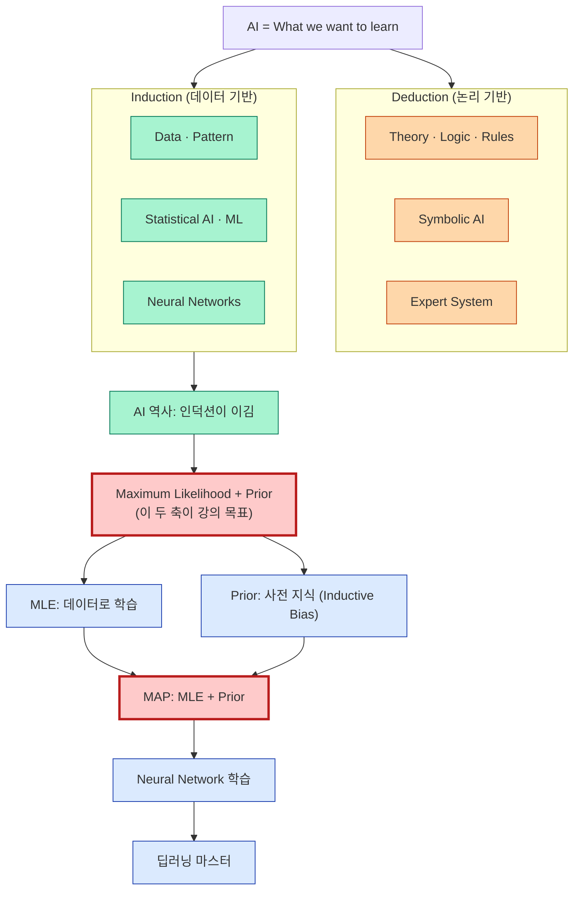
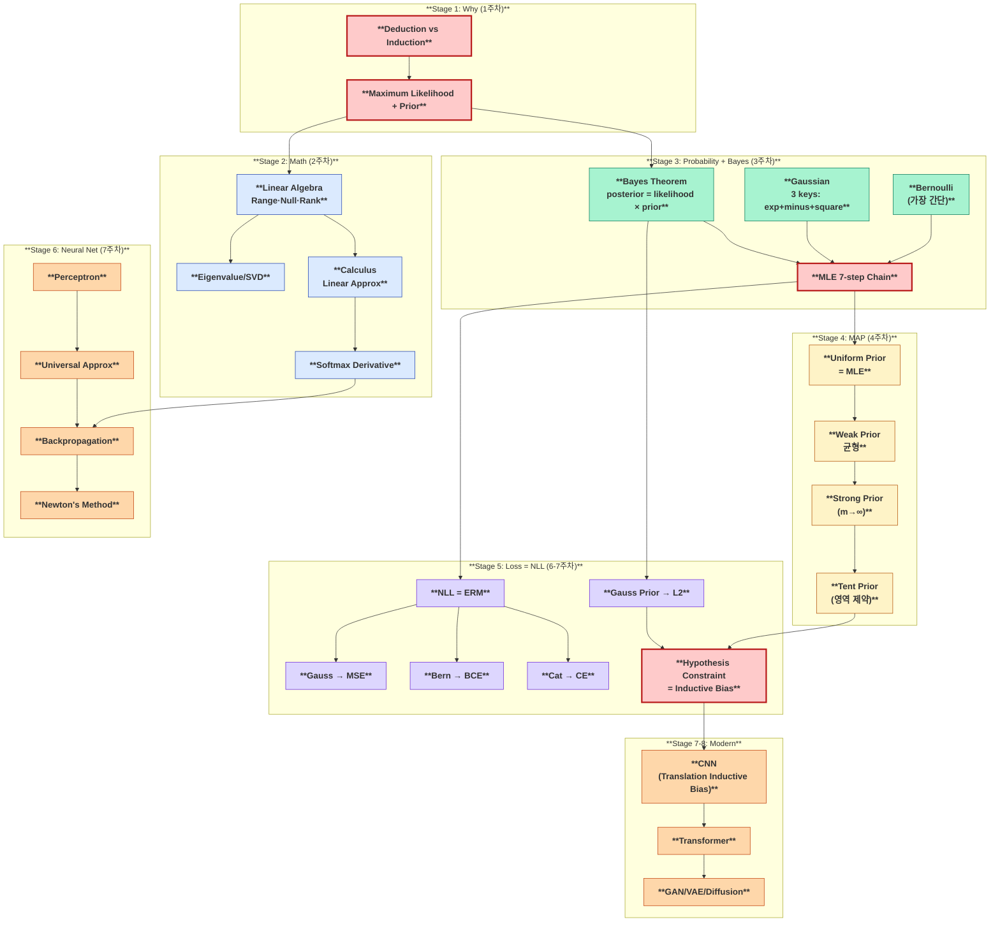
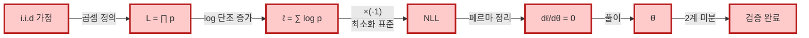
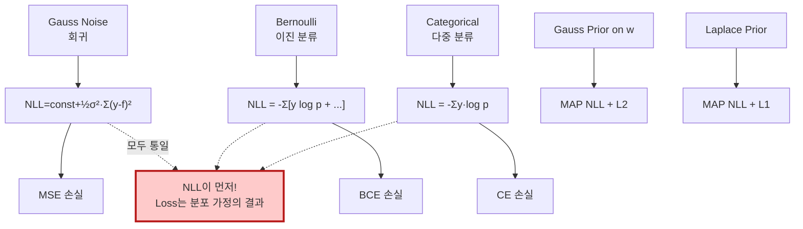
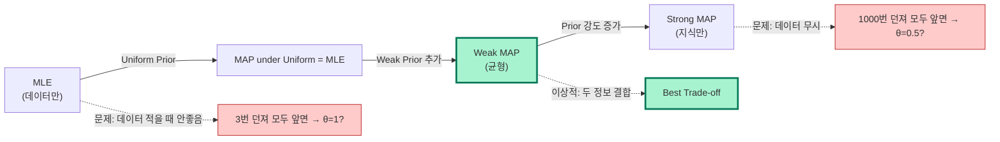
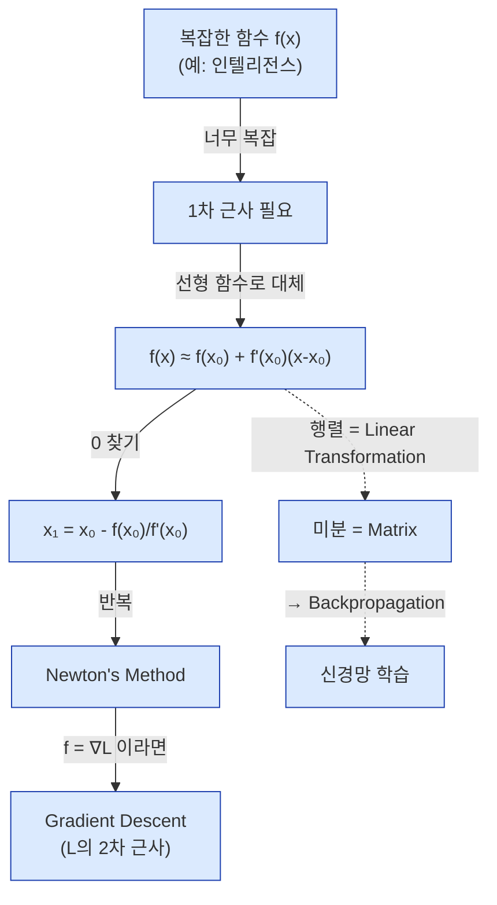
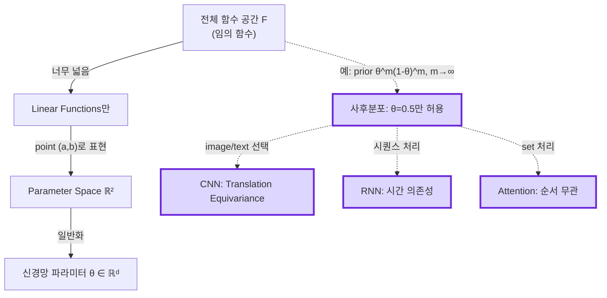

# 딥러닝 이론 학습 지도 v2 — 강의 강조 반영

> **Version 2** — 7주차 강의 스크립트에서 추출한 **교수의 강조 포인트와 메타 메시지**를 반영한 학습 순서·관계도.
>
> **v1 대비 변경점:** 강의 인용구를 학습 단계별로 배치, "교수가 강조한 흐름" Mermaid 추가, 채점 철학을 학습 목표에 명시.

---

## 0. 강의의 큰 그림 — 교수가 직접 그린 지도



**핵심:** 교수의 메시지는 "이 두 가지(MLE + Prior)를 이해하면 강의의 끝이다."

---

## 1. ★★★★★ 학습 순서 — 8주 코스 (강의 흐름 그대로)

### Stage 1: Why — 강의의 메타 메시지 (1주차)
> **"이 수업이 무엇을 하려는지를 먼저 이해하라."**

| 항목 | 학습 산출물 |
|------|-----------|
| Deduction vs Induction | 두 차이를 5분 안에 설명 가능 |
| AI 역사 | 알케미·증기기관·딥러닝 평행 이해 |
| 채점 철학 | "답만 적으면 0점" 인지 |
| 학습 목표 | "Maximum Likelihood + Prior" 외워두기 |

**완료 조건:** "왜 인덕션으로 시험 문제 풀면 안 되는가" 1분 내 답변.

### Stage 2: 수학 기초 (2주차) ★★★★★
> *"행렬은 마음의 고향이다. 우리가 아는 것은 행렬뿐이다."*

| 항목 | 핵심 |
|------|-----|
| Inner Product | 면접 단골! cos과의 관계 |
| Matrix = Linear Transformation | 둘이 같다는 정의 |
| Range, Null, Rank-Nullity | Fundamental Theorem of Linear Algebra |
| Eigenvalue/Vector | 큰 게 더 중요 (이미지 압축, Page Rank) |
| SVD | 임의 행렬에 적용, PCA의 기반 |
| Softmax 미분 | 기출 8번 핵심 |

**완료 조건:** Softmax 자코비안 $J = \text{diag}(p)-pp^T$ 손으로 유도.

### Stage 3: Probability + Bayes (3주차) ★★★★★
> *"오늘이 가장 중요한 날이다."*

| 항목 | 핵심 |
|------|-----|
| Bernoulli vs Gaussian | 두 분포 집중 |
| **가우시안의 3가지** | Exponential, Minus, Square |
| Bayesian vs Frequentist | 두 진영의 차이, 정의 |
| **베이즈 정리** | $p(H\|E) = p(E\|H)p(H)/p(E)$ |
| Belief Update = Learning | 베이지안 관점 학습의 본질 |
| MLE 7단계 체인 | i.i.d → 곱 → 로그 → 미분=0 |

**완료 조건:** 베르누이 MLE를 노트 없이 7단계로 손글씨 재현.

### Stage 4: MAP — 데이터 + 지식의 균형 (4주차) ★★★★★
> *"MLE = MAP under uniform prior. 거꾸로 이해하라."*

| 항목 | 핵심 |
|------|-----|
| Posterior $\propto$ Likelihood × Prior | log 합으로 변환 |
| Uniform Prior | MAP = MLE |
| 약한 Prior | 균형, $(k+1)/(n+2)$ |
| Strong Prior (m → ∞) | 데이터 무시, 0.5 고정 |
| Tent Prior (시험 7번) | 영역 제약 |
| MAP의 의미 | Inductive Bias의 시작 |

**완료 조건:** "데이터 적을 땐 MLE 안 좋고 강한 MAP가 좋다" 정량적 설명.

### Stage 5: ERM과 손실 함수 (6, 7주차) ★★★★★
> *"Loss Function이 먼저가 아니다. NLL이 먼저다."*

| 항목 | 핵심 |
|------|-----|
| ERM = NLL 등가성 | empirical distribution 적분 |
| Gauss → MSE | 음의 로그 → 제곱만 남음 |
| Bernoulli → BCE | 베르누이 NLL |
| Categorical → CE | 다중 분류 |
| MAP → 정규화 | Gauss prior → L2, Laplace prior → L1 |
| Hypothesis Space 제약 | Linear functions, Function → Parameter |

**완료 조건:** "왜 MSE 쓰는가?"에 "Gauss noise NLL 결과" 답변.

### Stage 6: 신경망 + 최적화 (7주차) ★★★★
> *"복잡한 함수는 1차로 근사한다. Newton's method가 본질."*

| 항목 | 핵심 |
|------|-----|
| Perceptron | Rosenblatt 1958, 머신러닝 시작 |
| Logistic Regression | Bernoulli + Linear |
| Universal Approximation | 1-층 + 충분한 뉴런 |
| Backpropagation | 4-step 식 |
| Activation 미분 | sigmoid, ReLU, tanh, GELU |
| Newton's method | 모든 최적화의 근본 |
| Gradient Descent | $\theta \leftarrow \theta - \eta \nabla L$ |

**완료 조건:** Sigmoid 미분 $\sigma(1-\sigma)$ 1분 내 유도.

### Stage 7: 일반화 + 정규화 (7-8주차) ★★★
| 항목 | 핵심 |
|------|-----|
| Bias-Variance 분해 | 교차항 0 증명 |
| Overfitting / Double Descent | 통념 도전 |
| L1, L2, Dropout, BN | Prior 관점에서 |
| Sharpness | 통념과 다름 |

### Stage 8: 고급 (CNN, RNN, Transformer, GAN/VAE/Diffusion) ★★
> *"이미지를 다룬다는 것은 또 다시 Hypothesis Space를 줄이는 것의 의미를 보여줍니다."*

| 항목 | 핵심 |
|------|-----|
| CNN | Translation equivariance (Inductive Bias) |
| RNN/LSTM | BPTT, vanishing gradient |
| Self-Attention | $QK^T/\sqrt{d_k}$, Softmax 미분 |
| Transformer | 6 블록 |
| GAN | Minimax |
| VAE | ELBO, Reparameterization |
| Diffusion | Forward/Reverse process |

---

## 2. ★★★★★ 강의의 핵심 흐름 (Mermaid)



---

## 3. 5대 핵심 체인 (시험 출제 35%)

### 3.1 NLL 체인 — i.i.d → 로그 → 미분=0
> *"이게 모든 분포의 MLE를 통일하는 체인입니다."*



### 3.2 분포 → 손실 체인 — "Loss는 NLL의 결과"



### 3.3 MLE ↔ MAP 균형 체인



### 3.4 Linear Approx 체인 — Newton's Method가 본질



### 3.5 Inductive Bias 체인 — Hypothesis Space 제약



---

## 4. ★★★ "어디에 쓰이는가" 매트릭스 (강의 강조 응용)

### 4.1 핵심 개념 × 사용처

| 개념 | CNN | RNN/LSTM | Transformer | VAE | Diffusion |
|------|-----|---------|------------|-----|-----------|
| **활성화** | ReLU | tanh+sigmoid | GELU | ReLU | (다양) |
| **Softmax** | 출력층 | 출력층 | **Attention 내** | - | - |
| **Backprop** | ✓ | BPTT | ✓ | ✓ | ✓ |
| **CE 손실** | 분류 | 분류 | 분류 | 재구성 | (조건부) |
| **MSE 손실** | 회귀 | 회귀 | 회귀 | 재구성 | loss term |
| **KL Divergence** | - | - | - | **ELBO** | **각 t의 KL** |
| **Convolution** | **본체** | - | - | (Conv VAE) | (U-Net) |
| **Self-Attention** | (ViT) | - | **본체** | - | (DiT) |
| **L2 정규화** | ✓ | ✓ | ✓ | ✓ | ✓ |

### 4.2 "강의가 가르친 8대 메시지" × 어디에서 활용

| 메시지 | 어디에 적용 |
|-------|----------|
| **i.i.d → 곱** | 모든 likelihood 유도, 미니배치 SGD |
| **로그 단조성** | NLL의 모든 미분, log-sum-exp trick |
| **미분=0 (페르마)** | MLE/MAP 풀이, 모든 최적화 |
| **분포 → 손실** | MSE, BCE, CE, MAE 모두 |
| **MAP = NLL + 정규화** | L2/L1, Dropout(베르누이 prior), BN |
| **Linear Approx** | Newton, GD, 신경망 forward 1차 근사 |
| **Function → Parameter** | 모든 신경망 파라미터화 |
| **Hypothesis 제약** | CNN/RNN/Transformer의 Inductive Bias |

---

## 5. ★★★★★ 시험 답안 작성 체크리스트 (교수의 채점 철학)

### 5.1 답안 첫 줄 (반드시!)
```
[모델 명시] y_i ~ Bern(θ) i.i.d, i=1,...,n
[가정 명시] i.i.d (독립), θ ∈ (0,1) (도메인), 미분 가능
```

### 5.2 단계별 "왜?" 한 문장
| 단계 | 표준 문장 |
|-----|---------|
| 곱 변환 | "i.i.d 가정에 의해 결합확률은 각 확률의 곱이다." |
| 로그 | "단조성으로 argmax 보존, 곱→합으로 미분 단순화, 수치 안정성." |
| -1 곱 | "ML 표준은 손실 최소화이므로 NLL = -ℓ로 변환." |
| 미분=0 | "ℓ은 (0,1) 내부 미분 가능 → 페르마 정리." |
| 검증 | "ℓ''(θ) < 0이므로 ℓ은 오목, 임계점이 전역 최댓값." |

### 5.3 정리 인용
- **Rank-Nullity 정리**: 선형대수 차원 분해
- **Spectral 정리**: 대칭행렬 직교 대각화
- **베이즈 정리**: $p(H|E) \propto p(E|H)p(H)$
- **Jensen 부등식**: 볼록 → $f(E[X]) \leq E[f(X)]$
- **Hoeffding 부등식**: 표본평균 수렴
- **페르마 정리**: 미분 가능 함수의 내부 극값 → 1차 도함수 = 0

### 5.4 절대 하지 말 것
- ❌ 답만 적기 ("MLE = k/n" 끝)
- ❌ 수식만 나열 (논리 서술 없음)
- ❌ 인덕션으로 풀기 (몇 개 예시로 일반화)
- ❌ 상수항 누락 (NLL 값이 필요할 때)

---

## 6. 8주 학습 일정

| 주 | 학습 (강의 흐름) | 주요 산출물 |
|---|---------------|----------|
| 1 | Why + 메타 메시지 | Deduction/Induction 차이 1분 설명 |
| 2 | Linear Algebra | 행렬 = 선형변환, Rank-Nullity, SVD |
| 3 | Probability + Bayes | Bernoulli, Gaussian 3-key, MLE 7단계 |
| 4 | MAP + Prior 강도 | uniform/weak/strong/tent 4종 비교 |
| 5 | ERM = NLL + Loss 함수 | Gauss→MSE, Bern→BCE, MAP→L2 |
| 6 | Newton + Backprop | Sigmoid 미분, BP 4식, GD 수렴 |
| 7 | Bias-Variance + 일반화 | 분해 증명, Double Descent, 정규화 |
| 8 | 고급 (CNN, Transformer 등) + 모의시험 | Softmax 자코비안, ELBO, 답안 작성 |

---

## 7. 자가 진단 체크리스트 (Stage별)

### Stage 1 ✓
- [ ] Deduction vs Induction 5분 설명
- [ ] "왜 인덕션으로 시험 풀면 안 되는가" 답변
- [ ] "Maximum Likelihood + Prior" 강의 목표 외움

### Stage 2 ✓
- [ ] 행렬식 2×2 즉답
- [ ] Range/Null/Rank-Nullity 그림으로 설명
- [ ] Eigenvalue 정의에서 특성방정식 유도
- [ ] SVD = U Σ Vᵀ 진술
- [ ] Softmax 자코비안 손유도

### Stage 3 ✓
- [ ] Bernoulli pmf 즉답
- [ ] Gauss 3가지 (exp+minus+square) 즉답
- [ ] 베이즈 정리 1줄 유도
- [ ] **베르누이 MLE 7단계 노트 없이 재현** ★★★

### Stage 4 ✓
- [ ] MLE = MAP under uniform prior 한 줄 설명
- [ ] m이 1, ∞일 때 결과 비교
- [ ] tent prior 영역 분리

### Stage 5 ✓
- [ ] Gauss → MSE 한 줄 유도
- [ ] Bern → BCE 한 줄 유도
- [ ] $H(p,q) = H(p) + KL(p\|q)$ 분해 증명
- [ ] L2 = Gauss prior, L1 = Laplace prior

### Stage 6 ✓
- [ ] Sigmoid 미분 $\sigma(1-\sigma)$ 1분 유도
- [ ] Backprop 4식 외움
- [ ] Newton's method = "L에 대해 2차 근사"
- [ ] Universal Approx 진술

### Stage 7 ✓
- [ ] Bias-Variance 분해 증명 (교차항 0)
- [ ] Double Descent 그림 설명
- [ ] L1/L2/Dropout/BN 4가지 정규화

### Stage 8 ✓
- [ ] Softmax + CE 그래디언트 = $p - y$ 유도
- [ ] LSTM 게이트 식 재현
- [ ] Attention $QK^T/\sqrt{d_k}$ 의미
- [ ] ELBO 유도

**모든 체크 ✓ = 강의 마스터.**

---

## 8. 학습 자료 매핑

| 본 가이드 § | final-fire 위치 |
|----------|--------------|
| §1 Stage 1 (Why) | (final-fire 미수록 — 본 가이드만) |
| §1 Stage 2 (Math) | `00-prerequisites/`, `01-eigen/`, `08-softmax/` |
| §1 Stage 3 (Bayes+MLE) | `02-gaussian/`, `04-mle-bernoulli/`, `09-killer-chains/` |
| §1 Stage 4 (MAP) | `05-07-map-*/` |
| §1 Stage 5 (Loss=NLL) | `09-killer-chains/04-06`, `11-extra-topics/04` |
| §1 Stage 6 (NN) | `11-extra-topics/01-08` |
| §1 Stage 7 (Generalization) | `11-extra-topics/03,06` |
| §1 Stage 8 (Modern) | (final-fire 미수록) |

---

## 9. ★★★★★ 마지막 한 줄 (강의의 정수)

> **"이 수업은 '딥러닝을 사용하는 법'이 아니라 'AI 역사에서 인덕션이 이긴 이유'와 '그 인덕션을 뒷받침하는 수학(MLE + Prior)'을 가르친다."**
>
> 그 핵심에는 **i.i.d → 로그 → 미분=0** 체인과 **분포 가정 → 손실 함수 등가성**과 **Hypothesis Space 제약 = Inductive Bias** 라는 세 가지 통합 원리가 있다.
>
> 이 세 가지를 답안의 모든 곳에서 인용할 수 있으면, 이 강의의 모든 시험을 통과할 수 있다.

---

**작성:** 2026-04-26 (v2)
**기반:** 7주차 강의 스크립트 직접 인용 + 742장 슬라이드
**다음:** [`master_readme_v2.md`](./master_readme_v2.md) 또는 [`MASTER-CONCEPTS_v2.md`](./MASTER-CONCEPTS_v2.md)
