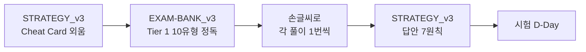
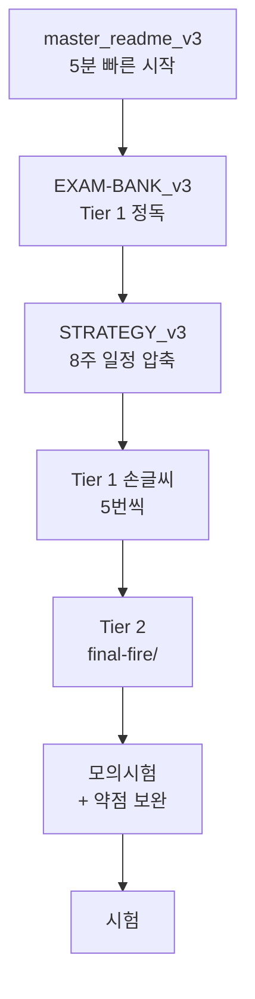
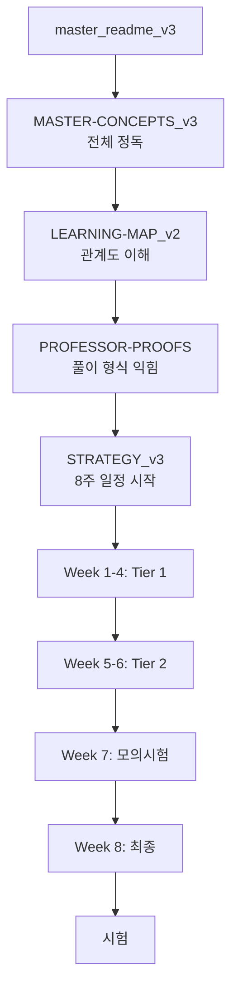

# 📘 Master Folder — 학습 가이드

> 이 폴더는 한양대 이성윤 교수의 「딥러닝」 강의를 마스터하기 위한 **11개의 문서 셋**을 담고 있습니다.
>
> **이 README는 그 11개 문서를 "무엇을 / 언제 / 어떤 순서로" 읽어야 하는지 안내합니다.**

---

## 🚀 30초 빠른 시작

**상황별 추천 시작점:**

| 상황 | 시작 문서 |
|------|---------|
| **시험 임박 (1주 미만)** | `STRATEGY_v3.md` → `EXAM-BANK_v3.md` (Tier 1) → Cheat Card 외움 |
| **시험 1-3주 남음** | `master_readme_v3.md` → `EXAM-BANK_v3.md` 통독 → 8주 일정 압축 |
| **여유 있음 (1개월+)** | `master_readme_v3.md` → `STRATEGY_v3.md` 8주 일정 따라가기 |
| **과목 전체 마스터** | `MASTER-CONCEPTS_v3.md` 정독 → `LEARNING-MAP_v2.md` Mermaid 이해 |
| **답안 작성 훈련** | `PROFESSOR-PROOFS.md` + `final-fire/` 폴더 |

---

## 📂 폴더 구조 한눈에 보기

```
docs/master/
│
├── 📌 시작 문서 (Entry Points) ─────────────────────────
│   ├── README.md                  ← 이 문서 (학습 가이드)
│   ├── master_readme.md           ← v1 안내 (역사적 보존)
│   ├── master_readme_v2.md        ← v2 안내 (강의 인용 추가)
│   └── master_readme_v3.md        ← v3 안내 (★ 최신, 작년 시험 반영)
│
├── 📚 본문 (Main Content) ─────────────────────────────
│   ├── MASTER-CONCEPTS.md         ← v1: 슬라이드 기반 14 섹션
│   ├── MASTER-CONCEPTS_v2.md      ← v2: + 강의 인용 + ★ 표시
│   └── MASTER-CONCEPTS_v3.md      ← v3: + 작년 출제 영역 보강
│
├── 🗺 관계도 (Visual Maps) ───────────────────────────
│   ├── LEARNING-MAP.md            ← v1: 5단계 학습 + 6 Mermaid
│   └── LEARNING-MAP_v2.md         ← v2: 8단계 + 8 Mermaid (강의 흐름)
│
├── 🎯 시험 대비 (Exam Prep) ★★★★★ ──────────────────
│   ├── PROFESSOR-PROOFS.md        ← 교수 직강 풀이 15개
│   ├── EXAM-BANK_v3.md            ← ★★★ 메인 풀이집 (작년+올해)
│   └── STRATEGY_v3.md             ← ★★★ 3-Tier 전략 + 8주 + Cheat Card
│
└── (참조 폴더)
    └── ../수업_스크립트/           ← 7주차 강의 녹취 (v2/v3 출처)
    └── ../../final-fire/           ← 답안 작성 훈련 (Tier 2)
```

---

## 📋 11개 문서 상세 가이드

### 1. `README.md` (이 문서) — **학습 가이드**
- **무엇:** 11개 문서의 사용 가이드
- **언제:** 시작할 때
- **다음:** `master_readme_v3.md` 또는 상황별 추천

---

### 2. `master_readme.md` (v1, 7.1KB) — **v1 안내**
- **무엇:** v1 (슬라이드 기반) 자료 안내
- **언제:** 역사적 참고용 (현재는 v3 권장)
- **포함:** v1의 MASTER-CONCEPTS·LEARNING-MAP 인덱스

---

### 3. `master_readme_v2.md` (v2, 10KB) — **v2 안내**
- **무엇:** v2 (강의 인용 + ★ 표시) 자료 안내
- **언제:** v1과의 차이를 알고 싶을 때
- **포함:** 교수의 메타 메시지 4개 (Deduction/Induction, Tango, 답만 적으면 0점, 행렬은 마음의 고향)

---

### 4. `master_readme_v3.md` (v3, 8.2KB) — **★ v3 안내 (최신)**
- **무엇:** v3 (작년 시험 100% 반영) 자료 안내
- **언제:** **여기서 시작 추천** (시험 대비 시)
- **포함:**
  - 작년 시험 9개 카테고리
  - 3-Tier 전략 요약
  - v1/v2/v3 비교
  - 5분 빠른 시작 가이드

---

### 5. `MASTER-CONCEPTS.md` (v1, 27KB) — **v1 본문**
- **무엇:** 슬라이드 742장 기반 14 섹션 정리
- **언제:** 과목 전체 큰 그림 (객관적 정리)
- **포함:** 모든 LaTeX 수식 ~120개

---

### 6. `MASTER-CONCEPTS_v2.md` (v2, 23KB) — **v2 본문**
- **무엇:** v1 + 강의 직접 인용 30개+ 추가
- **언제:** 교수의 강조 포인트가 궁금할 때
- **포함:** ★ 5단계 중요도 표시, 메타 메시지 8개

---

### 7. `MASTER-CONCEPTS_v3.md` (v3, 13KB) — **★ v3 본문**
- **무엇:** v2 보강 — 작년 시험 출제 영역 깊이 추가
- **언제:** 작년 출제 토픽 완전 마스터 시
- **포함:**
  - §3 Convex 4유형 증명
  - §4 정규분포 KL 명시 계산
  - §5 GD 수렴 $\eta < 2/\lambda_{\max}$ 증명
  - §7 Convolution + Pooling
  - §9 Markov / DAG (신규)
  - §10 모델 비교 표 (신규)
  - §11 PyTorch 5단계 (신규)
  - §12 손실 통합 (MSE/CE/NLL/KL)

---

### 8. `LEARNING-MAP.md` (v1, 19KB) — **v1 학습 지도**
- **무엇:** 5단계 학습 + 6 Mermaid 다이어그램
- **언제:** 개념 간 관계를 시각적으로 보고 싶을 때

---

### 9. `LEARNING-MAP_v2.md` (v2, 18KB) — **v2 학습 지도**
- **무엇:** 8단계 학습 (강의 주차 순서) + 8 Mermaid
- **언제:** 강의 흐름대로 학습할 때
- **포함:** 5대 핵심 체인 (NLL, 분포→손실, 신경망 학습, 일반화, Attention)

---

### 10. `PROFESSOR-PROOFS.md` (25KB) — **교수 직강 풀이 15개**
- **무엇:** 7주차 강의 스크립트에서 교수가 **직접 칠판에 푼** 수식 15개
- **언제:** 교수의 풀이 방식 그대로 따라하고 싶을 때 (시험 답안 형식)
- **포함:**
  1. Newton's Method (루트 7)
  2. 선형변환 ↔ 행렬 동치
  3. Range/Null + Rank-Nullity
  4. Vector·Matrix 미분 4종
  5. **Softmax 자코비안** ★
  6. Bayes Theorem 1줄 증명
  7. **Bernoulli MLE 7단계** ★
  8. MAP under Uniform = MLE
  9. MAP with Beta(2,2) prior
  10. **MAP with $\theta^m(1-\theta)^m$, m→∞** ★
  11. Tent Prior 영역 분리
  12. ERM = NLL 등가성
  13. **Gauss → MSE 유도** ★
  14. Bernoulli → BCE 유도
  15. Newton's Method = L의 2차 근사

---

### 11. `EXAM-BANK_v3.md` (26KB) — **★★★ 메인 풀이집**
- **무엇:** 작년 시험 + 올해 기출 + 변형 대비 통합 풀이집
- **언제:** **시험 대비 핵심 자료** (가장 자주 봐야 할 문서)
- **포함:**
  - **Tier 1:** 작년 시험 (★★★★★ 100% 출제) — 10유형
    1. Convex 4유형
    2. KL Divergence + Jensen + 정규분포 KL ★
    3. Bias-Variance 분해
    4. GD 수렴 $\eta < 2/\lambda_{\max}$ ★
    5. Convolution 출력 + Toeplitz
    6. Markov Chain / DAG
    7. 모델 비교 (Markov/RNN/Transformer)
    8. PyTorch 5단계
    9. Pooling Matrix
    10. MSE/CE/NLL/KL 통합
  - **Tier 2:** 올해 기출 8문제 요약
  - **Tier 3:** 변형 대비 (다양한 분포, 행렬 미분, VAE/Diffusion)

---

### 12. `STRATEGY_v3.md` (11KB) — **★★★ 시험 전략**
- **무엇:** 3-Tier 학습 전략 + 8주 일정 + Cheat Card
- **언제:** 학습 계획 세울 때, 시험 전날
- **포함:**
  - 3-Tier 시간 배분 (50/30/20)
  - 8주 학습 일정 (주차별 상세)
  - 시험 답안 작성 7원칙
  - **Cheat Card 1장** (시험 전날 외움)
  - 시험장 시간 배분 + 부분점수 사냥

---

## 🛤 학습 동선 (상황별)

### 🚨 응급 코스 (3일 미만)


**시간 분배:** 1일차 Cheat Card + Tier 1 1-5, 2일차 Tier 1 6-10, 3일차 손글씨 재현 + 답안 형식

---

### ⚡ 단기 코스 (1-2주)


---

### 📚 정규 코스 (1개월+)


---

## 🎯 추천 학습 시퀀스 (가장 일반적)

**모든 학생에게 추천하는 순서:**

```
1️⃣ master_readme_v3.md (5분)
   → 큰 그림 파악, v3 핵심 메시지

2️⃣ STRATEGY_v3.md §3-Tier (10분)
   → 시간 배분 결정, 8주 일정 확인

3️⃣ EXAM-BANK_v3.md Tier 1 표 (10분)
   → 작년 출제 10유형 인지

4️⃣ EXAM-BANK_v3.md Tier 1 풀이 (5-10시간)
   → 10유형 각각 정독 + 손글씨 재현

5️⃣ MASTER-CONCEPTS_v3.md (참조용)
   → 개념 깊이 이해 필요할 때만

6️⃣ PROFESSOR-PROOFS.md (참조용)
   → 답안 형식 확인할 때만

7️⃣ EXAM-BANK_v3.md Tier 2 (5시간)
   → 올해 8문제, final-fire/ 활용

8️⃣ STRATEGY_v3.md Cheat Card (시험 전날)
   → 1페이지로 모든 핵심 외움
```

---

## 🔍 문서 매핑표 — 원하는 정보 어디 있나?

| 찾는 정보 | 어느 문서? |
|---------|---------|
| **베르누이 MLE 7단계 풀이** | `EXAM-BANK_v3` Tier 2 #4 또는 `PROFESSOR-PROOFS` #7 |
| **정규분포 KL = ½(μ₁-μ₂)²** | `EXAM-BANK_v3` T1-2 또는 `MASTER-CONCEPTS_v3` §4.5 |
| **Convex 증명 4유형** | `EXAM-BANK_v3` T1-1 또는 `MASTER-CONCEPTS_v3` §3.2 |
| **GD 수렴 $\eta < 2/\lambda_{\max}$** | `EXAM-BANK_v3` T1-4 또는 `MASTER-CONCEPTS_v3` §5.2 |
| **Convolution 출력 크기** | `EXAM-BANK_v3` T1-5 또는 `MASTER-CONCEPTS_v3` §7.2 |
| **Markov vs RNN vs Transformer** | `EXAM-BANK_v3` T1-7 또는 `MASTER-CONCEPTS_v3` §10 |
| **Softmax 자코비안 유도** | `PROFESSOR-PROOFS` #5 또는 `EXAM-BANK_v3` Tier 2 #8 |
| **Cheat Card** | `STRATEGY_v3` 마지막 섹션 |
| **8주 학습 일정** | `STRATEGY_v3` §8주 |
| **답안 작성 7원칙** | `STRATEGY_v3` §원칙 |
| **교수의 메타 메시지** | `MASTER-CONCEPTS_v2` §0 |
| **개념 간 관계도 (Mermaid)** | `LEARNING-MAP_v2` |

---

## 📊 v1 / v2 / v3 차이 한눈에

| 측면 | v1 | v2 | v3 |
|------|-----|-----|-----|
| **출처** | 슬라이드 742장 | + 강의 스크립트 7주차 | + 작년 시험 5장 |
| **강조** | 객관적 정리 | 교수 메시지 + ★ | **작년 100% 출제** |
| **메인 산출물** | MASTER-CONCEPTS | + PROFESSOR-PROOFS | **+ EXAM-BANK** |
| **학습 단계** | 5 stage | 8 stage | **3-Tier** |
| **답안 가이드** | 일반 | 채점 철학 | **7원칙 + Cheat Card** |
| **추천 사용** | 큰 그림 | 강의 복습 | **시험 대비** |

---

## ❓ FAQ

### Q1. v1, v2, v3 중 어느 걸 봐야 해요?
**A.** 시험 대비라면 **v3**. 과목 큰 그림이라면 **v2**. v1은 역사적 참고용.

### Q2. 다 읽어야 하나요?
**A.** 아닙니다. 추천 시퀀스(위)대로 v3 위주로 보면 됩니다. v1·v2는 **참조용**.

### Q3. 시간이 정말 없어요. 1개만 본다면?
**A.** **`EXAM-BANK_v3.md`**. Tier 1 10유형만 마스터해도 시험 50%+.

### Q4. 답안 작성 형식은 어디?
**A.** `STRATEGY_v3.md` §답안 7원칙 + `PROFESSOR-PROOFS.md` (교수 풀이 형식).

### Q5. final-fire/ 폴더와 관계는?
**A.** `final-fire/`는 **올해 기출 8문제** 답안 작성 훈련용 (Tier 2). master 폴더는 **전체 큰 그림 + 작년 시험 (Tier 1)**.

### Q6. 강의 녹취록은 어디?
**A.** `../수업_스크립트/` 폴더 (7주차 분량). v2/v3의 출처.

---

## 📝 진도 체크리스트

### Tier 1 (작년 100% 출제) — 무조건 마스터
- [ ] T1-1. Convex 4유형 증명 (`EXAM-BANK_v3`)
- [ ] T1-2. KL ≥ 0 + 정규분포 KL = ½(μ₁-μ₂)²
- [ ] T1-3. Bias-Variance 분해 증명
- [ ] T1-4. GD 수렴 $\eta < 2/\lambda_{\max}$ 증명
- [ ] T1-5. Convolution + 출력 크기 + Toeplitz
- [ ] T1-6. Markov Chain + DAG
- [ ] T1-7. Markov vs RNN vs Transformer 비교
- [ ] T1-8. PyTorch 5단계 학습 루프
- [ ] T1-9. Avg Pooling Matrix
- [ ] T1-10. MSE/CE/NLL/KL 통합

### Tier 2 (올해 기출) — 7단계 체인
- [ ] 기출 1: 고유값 정의 증명
- [ ] 기출 2: 가우스 모멘트 + 가우스 적분
- [ ] 기출 3: Uniform E·Var
- [ ] 기출 4: Bernoulli MLE 7단계
- [ ] 기출 5: MAP $\theta^m(1-\theta)^m$ → 1/2
- [ ] 기출 6: MAP $\theta^m$ → 1
- [ ] 기출 7: Tent prior MAP
- [ ] 기출 8: Softmax 자코비안

### Tier 3 (변형 대비)
- [ ] 다양한 분포 모멘트
- [ ] 행렬 미분 ($-\log\sigma(Ax+b)$)
- [ ] VAE ELBO 유도
- [ ] Jensen 부등식

### 답안 작성 능력
- [ ] 답안 7원칙 외움 (`STRATEGY_v3`)
- [ ] Cheat Card 1장 외움
- [ ] 정리 5개 인용 가능 (페르마, 베이즈, Jensen, Spectral, Hoeffding)
- [ ] 시험장 시간 배분 계획

**모든 ✓ = A+ 준비 완료.**

---

## 🎓 마지막 한 줄

> **"작년 시험은 100% 출제. v3 자료 (특히 EXAM-BANK_v3 Tier 1)를 중심으로, 답안 7원칙 + 정리 인용 + Cheat Card 외우면 만점에 가까운 답안 가능."**
>
> **"이 README의 추천 시퀀스를 따라가세요. 시간이 부족하면 EXAM-BANK_v3 Tier 1 + STRATEGY_v3 Cheat Card 두 개만으로도 시험 80% 커버."**

---

**작성:** 2026-04-26
**버전:** v3 시점 통합 가이드
**파일 수:** 11개 (이 README 포함 12개)
**총 크기:** ~190KB
**다음:** [`master_readme_v3.md`](./master_readme_v3.md) 또는 [`STRATEGY_v3.md`](./STRATEGY_v3.md)
