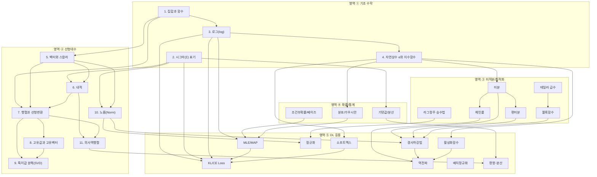

# 딥러닝 이론 중간고사 스터디 가이드 Part 1

> **대상 독자**: 중학교 1학년 수준의 수학 지식만 가진 사람
> **목표**: 딥러닝 이론의 기초 수학 + 선형대수 개념을 완전히 이해하기

---

# Layer 0: 전체 개념 의존 관계 맵

## Mermaid 다이어그램



## 의존 관계 화살표별 설명

| 출발 | 도착 | 왜 필요한가 |
|------|------|-------------|
| 집합과 함수 | 벡터와 스칼라 | 벡터 공간 $\mathbb{R}^n$은 집합이고, 벡터 연산은 함수의 특수한 형태다 |
| 집합과 함수 | 행렬과 선형변환 | 행렬은 "벡터 집합 → 벡터 집합"으로 가는 함수다 |
| 집합과 함수 | 로그 | 로그는 지수함수의 역함수 — "함수"와 "역함수" 개념이 선행되어야 한다 |
| 시그마 표기 | 내적 | 내적의 정의 $\mathbf{v}^T\mathbf{w} = \sum_i v_i w_i$가 시그마 표기 |
| 시그마 표기 | 노름 | 노름의 정의 $\|\mathbf{v}\| = \sqrt{\sum_i v_i^2}$가 시그마 표기 |
| 시그마 표기 | 기댓값/분산 | $E[X] = \sum_i x_i p(x_i)$ — 시그마 없이 기댓값을 쓸 수 없다 |
| 로그 | 자연상수 e | $e$는 $\ln$의 밑이고, $\ln(e^x) = x$라는 관계가 핵심 |
| 로그 | MLE/MAP | MLE는 로그우도를 최대화 — 곱을 합으로 바꾸는 로그 성질이 필수 |
| 로그 | KL/CE Loss | Cross-Entropy $= -\sum p \log q$ — 로그가 공식의 핵심 |
| 자연상수 e | 가우시안 | 가우시안 확률밀도 $\propto e^{-x^2/2}$ — $e$가 분포의 뼈대 |
| 자연상수 e | 소프트맥스 | 소프트맥스 $= e^{z_i}/\sum e^{z_j}$ — $e$가 공식 전체 |
| 자연상수 e | 활성화함수 | 시그모이드 $= 1/(1+e^{-x})$ — $e$가 필수 |
| 자연상수 e | 미분 | $e^x$의 미분 = $e^x$ 성질이 역전파 계산의 핵심 |
| 벡터 | 내적 | 내적은 두 벡터 사이의 연산이므로 벡터를 먼저 알아야 한다 |
| 벡터 | 행렬 | 행렬은 벡터들을 열로 쌓아 만든 것 |
| 벡터 | 노름 | 노름은 벡터의 크기를 재는 도구 |
| 내적 | 행렬 | 행렬 곱셈의 각 원소가 행 벡터와 열 벡터의 내적 |
| 내적 | 의사역행렬 | 정규방정식 $A^T A \mathbf{x} = A^T \mathbf{b}$에서 $A^T$는 내적 구조 |
| 행렬 | 고유값 | 고유값은 행렬의 성질이므로 행렬을 먼저 알아야 한다 |
| 행렬 | SVD | SVD는 행렬을 세 행렬의 곱으로 분해 |
| 행렬 | 의사역행렬 | 의사역행렬은 행렬의 역행렬이 없을 때의 대안 |
| 고유값 | SVD | SVD의 특이값은 $A^TA$의 고유값의 제곱근 |
| 노름 | 정규화 | L1/L2 정규화는 가중치 벡터의 노름에 페널티 부여 |
| 노름 | 경사하강법 | 그래디언트의 노름으로 학습 안정성 판단 |
| 의사역행렬 | 편향-분산 | 최소제곱 해의 성질이 편향-분산 분해의 기초 |
| 미분 | 편미분 | 편미분은 다변수에서의 미분 — 1변수 미분이 선행 |
| 미분 | 체인룰 | 체인룰은 합성함수의 미분법 |
| 미분 | 경사하강법 | 미분값(기울기) 방향으로 파라미터를 업데이트 |
| 편미분 | 경사하강법 | 다변수 함수의 각 방향 기울기 = 그래디언트 |
| 체인룰 | 역전파 | 역전파 알고리즘 = 체인룰의 체계적 적용 |

## 이 과목의 큰 그림

딥러닝의 최종 목표는 단 하나다: **데이터로부터 좋은 함수를 찾는 것**.

이 여정을 따라가 보자:

**1단계 — 기초 언어 익히기 (기초 수학)**
딥러닝의 수식을 읽으려면 먼저 "수학의 언어"를 알아야 한다. 집합과 함수는 "모델이 무엇인가"를 정의하고, 시그마는 "여러 개를 합치는" 표기법이며, 로그와 자연상수 $e$는 확률과 손실함수의 뼈대가 된다. 이 4개 도구 없이는 딥러닝 논문의 단 한 줄도 읽을 수 없다.

**2단계 — 데이터를 다루는 도구 익히기 (선형대수)**
실제 데이터는 숫자 하나가 아니라 숫자 수백~수만 개의 묶음(벡터)이다. 벡터들을 변환하는 도구가 행렬이고, 신경망의 각 층은 본질적으로 "행렬 곱셈 + 비선형 함수"다. 내적은 뉴런 하나의 연산이고, 고유값/SVD는 데이터의 구조를 파악하는 도구이며, 노름은 크기를 재는 자이고, 의사역행렬은 "정답이 완벽히 없을 때 최선의 답"을 찾는 방법이다.

**3단계 — 변화를 추적하는 도구 (미적분/최적화)**
좋은 함수를 "찾는" 과정은 결국 최적화다. 미분은 "어느 방향으로 가면 좋아지는가"를 알려주고, 체인룰은 복잡한 합성함수도 미분할 수 있게 해주며, 경사하강법은 그 방향으로 실제로 걸어가는 알고리즘이다.

**4단계 — 불확실성을 다루는 도구 (확률/통계)**
현실 데이터에는 노이즈가 있다. 확률은 이 불확실성을 수학으로 다루는 도구이고, 가우시안 분포는 가장 흔한 노이즈 모델이며, MLE는 "이 데이터가 나올 확률을 최대화하는 파라미터를 찾자"는 원칙이다.

**5단계 — 모든 것을 합쳐서 신경망 훈련하기 (DL 응용)**
앞의 모든 도구가 합쳐져서: 소프트맥스로 출력을 확률로 변환하고, Cross-Entropy로 얼마나 틀렸는지 측정하고, 역전파로 각 파라미터의 책임을 계산하고, 경사하강법으로 파라미터를 개선한다. 정규화와 배치정규화는 학습을 안정시키고, 편향-분산 트레이드오프는 "왜 더 복잡한 모델이 항상 좋지는 않은가"를 설명한다.

---

# 영역 ① 기초 수학

---

## 개념 1: 집합과 함수

### 왜 필요한가 (큰 그림에서의 위치)

딥러닝에서 "모델"이란 결국 **함수**다. 이미지를 넣으면 "고양이"라는 답이 나오고, 한국어 문장을 넣으면 영어 번역이 나오는 것 — 이 모든 것이 함수다. 함수가 뭔지 모르면 "모델이 뭔지" 자체를 이해할 수 없다. 그리고 함수를 제대로 정의하려면 "어디서 어디로 가는가"를 말해야 하는데, 그 "어디"를 표현하는 것이 집합이다.

### 선수 개념

없음. 이것이 가장 첫 번째 개념이다. 기본적인 사칙연산(더하기, 빼기, 곱하기, 나누기)만 알면 된다.

### 관련 문제

- **Q1**: 딥러닝 모델의 입출력 관계를 함수로 표현하는 문제 — 함수의 정의를 직접 적용
- **Q16**: 신경망의 한 층을 함수의 합성으로 표현 — $f(g(x))$ 합성함수 개념 사용
- **Q30**: 소프트맥스 함수의 정의역과 치역 분석 — 함수의 정의역/치역 개념 직접 적용

### 중1 눈높이 설명

#### 집합이란?

**집합**은 "무언가를 모아놓은 것"이다. 일상에서 비유하면:

- 우리 반 학생 전체 = 하나의 집합
- 1부터 10까지의 자연수 = 하나의 집합 $\{1, 2, 3, 4, 5, 6, 7, 8, 9, 10\}$
- 모든 실수 = 하나의 집합 $\mathbb{R}$

집합은 중괄호 $\{\}$ 안에 원소를 나열하거나, 조건으로 표현한다.

$$A = \{1, 2, 3\}$$

이것은 "A라는 집합에는 1, 2, 3이 들어있다"는 뜻이다.

**원소** — 집합에 들어있는 각각의 것. 2는 집합 $A$의 원소다. 이것을 $2 \in A$라고 쓴다. $\in$은 "~에 속한다"는 뜻이다.

딥러닝에서 자주 보는 집합:
- $\mathbb{R}$ : 모든 실수의 집합 (0, 1.5, -3.7, $\pi$, ... 전부)
- $\mathbb{R}^n$ : 실수 $n$개를 묶은 것들의 집합 (나중에 "벡터 공간"이라 부른다)
- $\{0, 1\}$ : 이진 분류의 출력 집합

#### 함수란?

**함수**는 "입력을 넣으면 출력이 나오는 기계"다.

자판기를 생각해보자:
- 500원 동전을 넣으면 → 콜라가 나온다
- 1000원 지폐를 넣으면 → 주스가 나온다

이때 자판기가 "함수"이고, 동전/지폐가 "입력(input)", 음료가 "출력(output)"이다.

수학에서는 이렇게 쓴다:

$$y = f(x)$$

- $x$ : 입력 (input)
- $f$ : 함수의 이름 (이 기계의 이름)
- $y$ : 출력 (output)
- $f(x)$ : "$f$라는 기계에 $x$를 넣었을 때 나오는 결과"

**예시**: $f(x) = 2x + 1$이라는 함수가 있다면:
- $f(3) = 2 \times 3 + 1 = 7$
- $f(0) = 2 \times 0 + 1 = 1$
- $f(-1) = 2 \times (-1) + 1 = -1$

입력 하나에 대해 출력은 반드시 **하나만** 나와야 한다. 자판기에 같은 동전을 넣었는데 어떨 때는 콜라, 어떨 때는 사이다가 나오면 그건 고장난 자판기이지 함수가 아니다.

#### 정의역, 공역, 치역

함수를 제대로 설명하려면 세 가지를 말해야 한다:

1. **정의역(Domain)**: 입력으로 넣을 수 있는 모든 값의 집합
2. **공역(Codomain)**: 출력이 속할 수 있는 범위의 집합
3. **치역(Range)**: 실제로 출력으로 나오는 값들의 집합

비유: 과녁 던지기 게임
- 정의역 = 내가 던질 수 있는 다트들 (입력)
- 공역 = 과녁판 전체 (출력이 갈 수 있는 곳)
- 치역 = 내가 실제로 맞힌 부분들 (실제 나온 출력)

치역은 항상 공역의 부분집합이다. (내가 맞힌 부분은 항상 과녁판 안에 있으니까)

수학적 표기: $f: A \to B$는 "함수 $f$는 집합 $A$에서 집합 $B$로 간다"는 뜻이다.
- $A$ = 정의역
- $B$ = 공역

**예시**: $f(x) = x^2$이고 $f: \mathbb{R} \to \mathbb{R}$이라 하면
- 정의역 = $\mathbb{R}$ (모든 실수를 넣을 수 있다)
- 공역 = $\mathbb{R}$ (모든 실수)
- 치역 = $[0, \infty)$ (제곱하면 항상 0 이상이므로, 음수는 실제로 안 나온다)

#### 딥러닝에서 함수

딥러닝 모델은 거대한 함수다:

$$\hat{y} = f_\theta(x)$$

- $x$ : 입력 데이터 (예: 이미지의 픽셀 값들)
- $\theta$ : 파라미터 (모델이 학습하는 가중치들)
- $\hat{y}$ : 예측값 (예: "고양이일 확률 0.95")
- $f_\theta$ : 파라미터 $\theta$에 의해 결정되는 함수

**딥러닝 학습 = 좋은 함수 $f_\theta$를 찾기 위해 $\theta$를 조정하는 과정**

합성함수도 중요하다. 신경망은 여러 층으로 이루어져 있는데, 각 층이 하나의 함수이고, 전체 신경망은 이들의 합성이다:

$$f(x) = f_3(f_2(f_1(x)))$$

이것은 "$x$를 $f_1$에 넣고, 그 결과를 $f_2$에 넣고, 그 결과를 $f_3$에 넣는다"는 뜻이다. 마치 공장의 컨베이어 벨트처럼, 원료가 여러 단계를 거쳐 완제품이 되는 것과 같다.

### 핵심 공식 정리

> **함수의 표기**
> $$y = f(x)$$
> 이 수식이 말하는 것: "입력 $x$를 함수 $f$에 넣으면 출력 $y$가 나온다"

> **함수의 정의**
> $$f: A \to B$$
> 이 수식이 말하는 것: "함수 $f$는 집합 $A$의 원소를 받아서 집합 $B$의 원소를 내놓는다"

> **합성함수**
> $$(g \circ f)(x) = g(f(x))$$
> 이 수식이 말하는 것: "$x$를 먼저 $f$에 넣고, 그 결과를 다시 $g$에 넣는다"

### 숫자로 확인

$f(x) = 3x + 2$, $g(x) = x^2$이라 하자.

**합성함수 $(g \circ f)(x)$ 계산:**

1. 먼저 $f(x)$를 계산: $f(4) = 3 \times 4 + 2 = 14$
2. 그 결과를 $g$에 넣기: $g(14) = 14^2 = 196$
3. 따라서 $(g \circ f)(4) = 196$

**순서가 바뀌면 결과도 바뀐다:**

1. $g(4) = 4^2 = 16$
2. $f(16) = 3 \times 16 + 2 = 50$
3. $(f \circ g)(4) = 50$

$196 \neq 50$이므로, 합성 순서가 중요하다! 신경망에서 층의 순서를 바꾸면 완전히 다른 모델이 되는 것과 같은 이치다.

### 다른 개념과의 연결

- → **벡터와 스칼라 (개념 5)**: 벡터 공간 $\mathbb{R}^n$은 집합이다. 신경망의 함수는 $f: \mathbb{R}^n \to \mathbb{R}^m$으로 표현된다.
- → **행렬과 선형변환 (개념 7)**: 행렬은 "선형 함수"를 표현하는 도구다.
- → **로그 (개념 3)**: 로그는 지수함수의 역함수 — "역함수"를 이해하려면 함수 개념이 먼저다.
- → **모든 후속 개념**: 딥러닝의 모든 것은 함수의 언어로 기술된다.

### 자가 점검 문제

**Q1.** $f(x) = 5x - 3$일 때, $f(2)$는?

> **답**: $f(2) = 5 \times 2 - 3 = 10 - 3 = 7$

**Q2.** $f(x) = x + 1$, $g(x) = 2x$일 때, $g(f(3))$은?

> **답**: $f(3) = 3 + 1 = 4$, $g(4) = 2 \times 4 = 8$. 따라서 $g(f(3)) = 8$.

---

## 개념 2: 시그마(Σ) 표기

### 왜 필요한가 (큰 그림에서의 위치)

딥러닝 수식의 80% 이상에 $\Sigma$가 등장한다. 손실함수, 기댓값, 내적, 노름, 확률 분포 — 전부 "여러 개를 더하는" 연산이 핵심이다. $\Sigma$를 모르면 딥러닝의 거의 모든 공식을 읽을 수 없다. 프로그래밍의 for 루프와 완전히 같은 개념이니, 코딩을 아는 사람에게는 친숙할 것이다.

### 선수 개념

- 기본 사칙연산 (더하기)
- 개념 1의 함수 표기 ($f(x)$)

### 관련 문제

- **Q1**: 벡터의 내적 계산 — $\sum_i v_i w_i$ 형태로 내적을 시그마로 표현
- **Q6**: Cross-Entropy 손실 계산 — $-\sum_i y_i \log(\hat{y}_i)$ 형태
- **Q11**: 노름 계산 — $\|\mathbf{v}\| = \sqrt{\sum_i v_i^2}$
- **Q14**: MLE에서 로그우도 — $\sum_i \log p(x_i | \theta)$
- **Q17**: 평균 계산 — $\bar{x} = \frac{1}{n}\sum_{i=1}^{n} x_i$
- **Q20**: 분산 계산 — $\text{Var}(X) = \frac{1}{n}\sum_{i=1}^{n}(x_i - \bar{x})^2$

### 중1 눈높이 설명

#### 시그마란 무엇인가?

$\Sigma$는 그리스 문자 "시그마"의 대문자이고, 수학에서 "전부 더해라!"라는 뜻이다.

일상 비유를 들어보자. 선생님이 이렇게 말한다고 하자:

> "1번 학생부터 5번 학생까지의 시험 점수를 모두 더해라."

이것을 수학 기호로 쓰면:

$$\sum_{i=1}^{5} x_i$$

하나씩 뜯어보자:
- $\sum$ : "전부 더해라"
- $i=1$ (아래쪽): "1번부터 시작해서" (시작값)
- $5$ (위쪽): "5번까지" (끝값)
- $x_i$ : "$i$번째 값" ($x_1$은 1번 학생 점수, $x_2$는 2번 학생 점수, ...)

풀어쓰면:

$$\sum_{i=1}^{5} x_i = x_1 + x_2 + x_3 + x_4 + x_5$$

**그냥 하나씩 더하는 것이다!** 시그마는 "긴 덧셈을 짧게 쓰는 약속"일 뿐이다.

#### 프로그래밍의 for 루프와 비교

파이썬 코드로 보면 완전히 같다:

```python
# 수학: Σ(i=1~5) x_i
total = 0
for i in range(1, 6):   # i = 1, 2, 3, 4, 5
    total += x[i]        # x_i를 더한다
```

시그마 = for 루프 + 누적 합산. 그 이상도 이하도 아니다.

#### 구체적 숫자 예시

5명의 학생 점수가 이렇다고 하자:
- $x_1 = 80$, $x_2 = 90$, $x_3 = 75$, $x_4 = 85$, $x_5 = 70$

$$\sum_{i=1}^{5} x_i = 80 + 90 + 75 + 85 + 70 = 400$$

#### 시그마 안에 수식이 있는 경우

시그마 안에는 단순한 $x_i$만 오는 것이 아니라 복잡한 수식이 올 수도 있다:

$$\sum_{i=1}^{3} i^2 = 1^2 + 2^2 + 3^2 = 1 + 4 + 9 = 14$$

$$\sum_{i=1}^{4} (2i + 1) = (2 \cdot 1 + 1) + (2 \cdot 2 + 1) + (2 \cdot 3 + 1) + (2 \cdot 4 + 1) = 3 + 5 + 7 + 9 = 24$$

규칙: $i$ 자리에 시작값부터 끝값까지 하나씩 대입하고, 그 결과를 전부 더한다.

#### 평균 공식

평균을 시그마로 쓰면:

$$\bar{x} = \frac{1}{n} \sum_{i=1}^{n} x_i$$

풀어쓰면: "전부 더하고($\sum$), 개수($n$)로 나눠라". 우리가 아는 평균 공식 그대로다.

위 예시에서: $\bar{x} = \frac{400}{5} = 80$

#### 이중 시그마

가끔 시그마가 두 번 나온다:

$$\sum_{i=1}^{2} \sum_{j=1}^{3} a_{ij}$$

이것은 이중 for 루프다:

```python
total = 0
for i in range(1, 3):      # i = 1, 2
    for j in range(1, 4):   # j = 1, 2, 3
        total += a[i][j]
```

표로 나타내면 ($a_{ij}$가 $i$행 $j$열이라면):

|  | j=1 | j=2 | j=3 |
|--|-----|-----|-----|
| i=1 | $a_{11}$ | $a_{12}$ | $a_{13}$ |
| i=2 | $a_{21}$ | $a_{22}$ | $a_{23}$ |

이중 시그마 = 표의 모든 칸을 다 더한다.

예: $a_{11}=1, a_{12}=2, a_{13}=3, a_{21}=4, a_{22}=5, a_{23}=6$이면

$$\sum_{i=1}^{2} \sum_{j=1}^{3} a_{ij} = 1+2+3+4+5+6 = 21$$

#### 딥러닝에서 시그마가 쓰이는 곳

1. **내적**: $\mathbf{v} \cdot \mathbf{w} = \sum_{i=1}^{n} v_i w_i$
2. **손실함수**: $L = -\sum_{i=1}^{n} y_i \log(\hat{y}_i)$ (Cross-Entropy)
3. **평균 손실**: $\frac{1}{N}\sum_{i=1}^{N} L_i$ (미니배치 평균)
4. **기댓값**: $E[X] = \sum_{i} x_i p(x_i)$
5. **소프트맥스의 분모**: $\sum_{j=1}^{K} e^{z_j}$

### 핵심 공식 정리

> **시그마의 정의**
> $$\sum_{i=a}^{b} f(i) = f(a) + f(a+1) + \cdots + f(b)$$
> 이 수식이 말하는 것: "$i$를 $a$부터 $b$까지 바꿔가며 $f(i)$를 전부 더한다"

> **시그마의 성질 1 — 상수 빼기**
> $$\sum_{i=1}^{n} c \cdot x_i = c \cdot \sum_{i=1}^{n} x_i$$
> 이 수식이 말하는 것: "모든 항에 같은 수를 곱한 합 = 합에 그 수를 곱한 것" (모든 학생 점수를 2배 한 후 더하기 = 먼저 다 더한 후 2배 하기)

> **시그마의 성질 2 — 덧셈 분리**
> $$\sum_{i=1}^{n} (x_i + y_i) = \sum_{i=1}^{n} x_i + \sum_{i=1}^{n} y_i$$
> 이 수식이 말하는 것: "합의 합 = 각각 합한 것의 합"

> **평균**
> $$\bar{x} = \frac{1}{n}\sum_{i=1}^{n} x_i$$
> 이 수식이 말하는 것: "전부 더해서 개수로 나눈다"

### 숫자로 확인

$x_1 = 2, x_2 = 5, x_3 = 3$일 때 시그마 성질을 확인해보자.

**성질 1 확인** ($c = 4$):
- 좌변: $\sum_{i=1}^{3} 4x_i = 4(2) + 4(5) + 4(3) = 8 + 20 + 12 = 40$
- 우변: $4 \cdot \sum_{i=1}^{3} x_i = 4 \cdot (2+5+3) = 4 \cdot 10 = 40$ ✓

**$\sum_{i=1}^{3} x_i^2$ 계산** (주의: $x_i^2$이지 $(\sum x_i)^2$이 아니다!):
- $\sum_{i=1}^{3} x_i^2 = 2^2 + 5^2 + 3^2 = 4 + 25 + 9 = 38$
- $\left(\sum_{i=1}^{3} x_i\right)^2 = (2+5+3)^2 = 10^2 = 100$
- $38 \neq 100$ — **시그마 안의 제곱과 시그마 밖의 제곱은 다르다!** 이것은 흔한 실수이므로 주의.

### 다른 개념과의 연결

- → **내적 (개념 6)**: 내적 $= \sum_i v_i w_i$로, 시그마가 내적의 정의 자체다
- → **노름 (개념 10)**: $\|\mathbf{v}\|_2 = \sqrt{\sum_i v_i^2}$
- → **기댓값/분산**: $E[X] = \sum x_i p_i$, $\text{Var}(X) = \sum (x_i - \mu)^2 p_i$
- → **Cross-Entropy**: $H(p,q) = -\sum p_i \log q_i$
- → **MLE**: $\log L(\theta) = \sum_i \log p(x_i|\theta)$

### 자가 점검 문제

**Q1.** $\sum_{i=1}^{4} (3i - 1)$을 계산하라.

> **답**: $(3 \cdot 1 - 1) + (3 \cdot 2 - 1) + (3 \cdot 3 - 1) + (3 \cdot 4 - 1) = 2 + 5 + 8 + 11 = 26$

**Q2.** $\sum_{k=0}^{3} 2^k$을 계산하라.

> **답**: $2^0 + 2^1 + 2^2 + 2^3 = 1 + 2 + 4 + 8 = 15$

---

## 개념 3: 로그(log)

### 왜 필요한가 (큰 그림에서의 위치)

딥러닝에서 로그는 세 곳에서 핵심적으로 쓰인다:
1. **MLE (최대우도추정)**: 여러 확률의 곱 → 로그를 씌워서 합으로 변환. 곱셈은 계산이 어렵고 아주 작은 수가 되지만, 합이면 쉽다.
2. **Cross-Entropy Loss**: $-\sum p \log q$로 정의되며, 분류 문제의 표준 손실함수다.
3. **정보 이론**: 정보량 $= -\log p$ — "놀라운 정도"를 수학으로 표현.

로그를 모르면 딥러닝의 학습 과정(손실 계산 → 역전파)의 첫 단추인 "손실함수"를 이해할 수 없다.

### 선수 개념

- 거듭제곱 ($2^3 = 8$)
- 개념 1의 함수와 역함수 개념

### 관련 문제

- **Q1**: 로그 성질을 이용한 수식 변환
- **Q5**: 정보 이론에서 정보량 $-\log_2 p$ 계산
- **Q6**: Cross-Entropy Loss 계산에 $\log$ 직접 사용
- **Q10**: 가우시안 로그우도 계산 — $\log$를 씌워서 지수 제거
- **Q14**: MLE에서 로그우도 최대화 — 곱→합 변환
- **Q20**: KL Divergence에 $\log$ 등장
- **Q30**: 소프트맥스 + CE Loss 결합 유도에 $\log$ 사용

### 중1 눈높이 설명

#### 로그란 무엇인가?

로그는 한마디로 **"몇 번 곱해야 하는가?"** 라는 질문의 답이다.

비유를 들어보자. 세균이 1마리 있고, 매 시간마다 2배로 늘어난다:
- 0시간 후: 1마리
- 1시간 후: 2마리
- 2시간 후: 4마리
- 3시간 후: 8마리

질문: "8마리가 되려면 몇 시간이 걸리는가?"

답: 3시간. 왜냐하면 $2^3 = 8$이니까.

이것을 로그로 쓰면:

$$\log_2 8 = 3$$

읽는 법: "로그 밑 2의 8은 3이다" = "2를 몇 번 곱하면 8이 되는가? 답: 3번"

#### 로그의 정의

$$\log_a b = c \quad \Longleftrightarrow \quad a^c = b$$

- $a$ : **밑**(base) — 곱하는 수
- $b$ : **진수** — 도달하고 싶은 수
- $c$ : **로그 값** — 곱하는 횟수

**핵심 번역**: $\log_a b$는 "$a$를 몇 번 곱하면 $b$가 되는가?"의 답이다.

몇 가지 예시:
- $\log_2 16 = 4$ ← $2^4 = 16$이니까 (2를 4번 곱하면 16)
- $\log_{10} 1000 = 3$ ← $10^3 = 1000$이니까
- $\log_3 9 = 2$ ← $3^2 = 9$이니까
- $\log_2 1 = 0$ ← $2^0 = 1$이니까 (뭐든 0번 곱하면 1)
- $\log_a a = 1$ ← $a^1 = a$이니까 (자기 자신을 1번 곱하면 자기 자신)

#### 로그의 세 가지 핵심 성질

**성질 1: 곱 → 합 변환 (가장 중요!)**

$$\log(xy) = \log x + \log y$$

왜 성립하는가? $a^m \times a^n = a^{m+n}$이기 때문이다.
- $2^3 = 8$이고 $2^2 = 4$이면
- $8 \times 4 = 32 = 2^5 = 2^{3+2}$
- 따라서 $\log_2(8 \times 4) = \log_2 8 + \log_2 4 = 3 + 2 = 5$ ✓

**이 성질이 MLE에서 핵심이다**: 데이터 100개의 확률을 곱하면 $p_1 \times p_2 \times \cdots \times p_{100}$인데, 이건 아주 작은 수가 된다 (0.001 × 0.002 × ... = 거의 0). 하지만 로그를 씌우면 $\log p_1 + \log p_2 + \cdots + \log p_{100}$으로, 합이 되어 계산이 쉬워진다.

**성질 2: 나누기 → 빼기**

$$\log\frac{x}{y} = \log x - \log y$$

**성질 3: 지수 내리기**

$$\log(x^n) = n \log x$$

예: $\log_2(2^{10}) = 10 \cdot \log_2 2 = 10 \cdot 1 = 10$

#### 자연로그 (ln)

밑이 자연상수 $e \approx 2.718$인 로그를 **자연로그**라 하고, $\ln$ 또는 $\log$로 쓴다.

$$\ln x = \log_e x$$

딥러닝에서 그냥 $\log$라고 쓰면 대부분 $\ln$ (밑 $e$)을 의미한다. 왜 하필 $e$냐고? $e$를 밑으로 하면 미분이 깔끔해지기 때문이다 (개념 4에서 자세히).

핵심 사실:
- $\ln(e) = 1$ (정의상)
- $\ln(1) = 0$ ($e^0 = 1$이니까)
- $\ln(e^x) = x$ (로그와 지수는 서로 취소)
- $e^{\ln x} = x$ (마찬가지)

#### 로그 그래프의 모양

$y = \log x$의 그래프는:
- $x = 1$일 때 $y = 0$ (어떤 밑이든 $\log 1 = 0$)
- $x > 1$이면 $y > 0$ (양수)
- $0 < x < 1$이면 $y < 0$ (음수)
- $x$가 커질수록 $y$도 커지지만, **점점 느리게** 커진다
- $x = 0$이면 $y = -\infty$ (로그는 0에서 음의 무한대로 간다)

이 마지막 성질이 중요하다: Cross-Entropy에서 확률이 0에 가까우면 $-\log(0) \to +\infty$로 손실이 폭발한다 → "완전히 틀린 예측에 큰 벌점"을 주는 효과.

#### 딥러닝에서 로그의 역할 구체 예

**Cross-Entropy Loss** (분류 문제의 표준 손실함수):

정답이 "고양이"(클래스 1)인 이미지가 있고, 모델이 각 클래스의 확률을 출력한다:
- 모델 A: 고양이 확률 0.9, 개 확률 0.1
- 모델 B: 고양이 확률 0.1, 개 확률 0.9

Cross-Entropy Loss = $-\log(\text{정답 클래스의 확률})$

- 모델 A의 Loss: $-\log(0.9) \approx 0.105$ (작은 벌점 → 잘 맞췄으니까)
- 모델 B의 Loss: $-\log(0.1) \approx 2.303$ (큰 벌점 → 틀렸으니까)

로그 덕분에 "틀릴수록 기하급수적으로 큰 벌점"이 자연스럽게 만들어진다.

### 핵심 공식 정리

> **로그의 정의**
> $$\log_a b = c \iff a^c = b$$
> 이 수식이 말하는 것: "$a$를 $c$번 곱하면 $b$가 된다"

> **곱 → 합 (MLE의 핵심)**
> $$\log(xy) = \log x + \log y$$
> 이 수식이 말하는 것: "곱의 로그 = 로그의 합. 곱셈을 덧셈으로 바꿔준다."

> **지수 내리기**
> $$\log(x^n) = n \log x$$
> 이 수식이 말하는 것: "지수가 앞으로 내려온다"

> **로그-지수 상쇄**
> $$\ln(e^x) = x, \quad e^{\ln x} = x$$
> 이 수식이 말하는 것: "$\ln$과 $e^{(\cdot)}$는 서로의 역함수이므로 만나면 상쇄된다"

### 숫자로 확인

**곱 → 합 성질 확인** (밑 = 10 사용):

$\log_{10}(100 \times 1000)$을 두 가지 방법으로 계산:

방법 1 (직접): $100 \times 1000 = 100000 = 10^5$이므로 $\log_{10}(100000) = 5$

방법 2 (성질): $\log_{10} 100 + \log_{10} 1000 = 2 + 3 = 5$ ✓

**Cross-Entropy 수치 예시**:

3-클래스 분류. 정답 = [1, 0, 0] (첫 번째 클래스). 모델 예측 확률 = [0.7, 0.2, 0.1].

$$L = -\sum_{i=1}^{3} y_i \log(\hat{y}_i) = -(1 \cdot \log 0.7 + 0 \cdot \log 0.2 + 0 \cdot \log 0.1)$$

$0$이 곱해진 항은 사라지므로:

$$L = -\log(0.7) \approx -(-0.357) = 0.357$$

### 다른 개념과의 연결

- → **자연상수 $e$ (개념 4)**: $\ln$과 $e$는 짝꿍. $e$를 알아야 $\ln$의 미분을 이해한다.
- → **MLE/MAP**: $\log L(\theta) = \sum \log p(x_i|\theta)$ — 곱→합 변환이 MLE의 핵심 트릭
- → **Cross-Entropy Loss**: $-\sum p \log q$ — 로그가 손실함수의 뼈대
- → **KL Divergence**: $D_{KL}(p\|q) = \sum p \log \frac{p}{q}$ — 로그의 나누기→빼기 성질 사용
- → **정보 이론**: $-\log p$는 정보량. 확률이 낮을수록 정보가 많다.

### 자가 점검 문제

**Q1.** $\log_2 32$는?

> **답**: $2^5 = 32$이므로 $\log_2 32 = 5$

**Q2.** $\log(a^3 b^2)$을 전개하라.

> **답**: $\log(a^3 b^2) = \log(a^3) + \log(b^2) = 3\log a + 2\log b$

---

## 개념 4: 자연상수 e와 지수함수

### 왜 필요한가 (큰 그림에서의 위치)

자연상수 $e \approx 2.71828...$은 딥러닝 곳곳에 숨어있다:
- **시그모이드 함수**: $\sigma(x) = \frac{1}{1 + e^{-x}}$ (이진 분류의 핵심)
- **소프트맥스 함수**: $\text{softmax}(z_i) = \frac{e^{z_i}}{\sum_j e^{z_j}}$ (다중 분류의 핵심)
- **가우시안 분포**: $p(x) \propto e^{-x^2/2}$ (통계의 기본 분포)
- **미분의 핵심 성질**: $\frac{d}{dx}e^x = e^x$ (자기 자신이 미분값! 이것이 역전파를 가능하게 한다)

$e$를 모르면 활성화함수, 확률분포, 손실함수를 전혀 이해할 수 없다.

### 선수 개념

- 거듭제곱 ($a^n$의 의미)
- 개념 3의 로그 (특히 자연로그 $\ln$)

### 관련 문제

- **Q10**: 가우시안 분포의 확률밀도함수에 $e$ 등장
- **Q12**: 시그모이드 함수 분석 — $e^{-x}$ 사용
- **Q13**: 소프트맥스 함수 계산 — $e^{z_i}$ 사용
- **Q15**: 테일러 급수에서 $e^x$의 전개
- **Q22**: Cross-Entropy + 소프트맥스 결합 — $e$ 등장
- **Q28**: 배치정규화에서 정규화 공식 유도 — 가우시안 가정에 $e$ 사용

### 중1 눈높이 설명

#### e는 어디서 오는가? — 복리 이야기

은행에 100만원을 넣고 연 이자율이 100%(1년에 원금만큼 이자)라 하자.

**방법 1: 1년에 한 번 이자 지급**
- 1년 후: $100 \times (1 + 1) = 100 \times 2 = 200$만원

**방법 2: 6개월마다 이자 지급 (반기 복리)**
이자율을 반으로 나눠서 두 번 적용:
- 6개월 후: $100 \times (1 + 0.5) = 150$만원
- 1년 후: $150 \times (1 + 0.5) = 225$만원
- 계산: $100 \times (1 + \frac{1}{2})^2 = 100 \times 1.5^2 = 100 \times 2.25 = 225$만원

**방법 3: 매월 이자 지급 (월 복리)**
- $100 \times (1 + \frac{1}{12})^{12} = 100 \times 1.0833...^{12} \approx 100 \times 2.613 = 261.3$만원

**방법 4: 매일 이자 지급**
- $100 \times (1 + \frac{1}{365})^{365} \approx 100 \times 2.7146 = 271.46$만원

**방법 5: 매 순간 이자 지급 (연속 복리)**
- $100 \times \lim_{n \to \infty}(1 + \frac{1}{n})^n = 100 \times e \approx 100 \times 2.71828... = 271.83$만원

패턴이 보이는가? 이자 지급 횟수를 무한히 늘리면, 금액은 한없이 커지지 않고 **특정 값에 수렴한다**. 그 값이 바로 $e$다:

$$e = \lim_{n \to \infty}\left(1 + \frac{1}{n}\right)^n \approx 2.71828...$$

$e$는 $\pi$처럼 무한소수이고, 자연계 곳곳에 나타나는 근본적인 상수다.

#### 지수함수 $e^x$

$e^x$는 "$e$를 $x$번 곱한 것"이다 ($x$가 정수가 아닐 수도 있다).

몇 가지 값:
- $e^0 = 1$ (뭐든 0제곱은 1)
- $e^1 = e \approx 2.718$
- $e^2 \approx 7.389$
- $e^{-1} = 1/e \approx 0.368$
- $e^{-\infty} = 0$ ($e$의 음의 무한대 제곱 → 0에 수렴)
- $e^{+\infty} = \infty$ (무한히 커짐)

**$e^x$의 그래프 특징**:
- 항상 양수 ($e^x > 0$ 모든 $x$에 대해)
- $x$가 커지면 매우 빠르게 증가 (지수적 증가)
- $x$가 매우 작으면 (음의 큰 수) 0에 가까워짐
- $x = 0$에서 값은 1

#### 왜 $e^x$가 특별한가? — 미분 성질

$e^x$의 가장 놀라운 성질:

$$\frac{d}{dx}e^x = e^x$$

**미분해도 자기 자신이 나온다!**

이게 왜 중요한가? 딥러닝에서 역전파(backpropagation)할 때 모든 함수의 미분을 계산해야 한다. $e^x$가 미분해도 변하지 않으므로:
- 시그모이드의 미분이 깔끔해지고
- 소프트맥스의 미분이 깔끔해지고
- 가우시안의 미분이 깔끔해진다

만약 $2^x$나 $3^x$를 쓰면 미분할 때 $\ln 2$나 $\ln 3$ 같은 추가 상수가 계속 붙어서 복잡해진다. $e$를 밑으로 쓰면 이런 상수가 1이 되어 사라진다.

#### $e^x$와 $\ln x$의 관계

$e^x$와 $\ln x$는 서로 **역함수**다. 마치 곱하기와 나누기처럼 서로를 취소한다:

$$\ln(e^x) = x \quad \text{(ln이 e를 취소)}$$
$$e^{\ln x} = x \quad \text{(e가 ln을 취소)}$$

이것은 딥러닝 수식 변형에서 핵심적으로 쓰인다. 예:

MLE에서 우도함수 $L = \prod_i p_i$가 있으면 로그를 씌워서:
$$\ln L = \ln\left(\prod_i p_i\right) = \sum_i \ln p_i$$

나중에 다시 원래 확률로 돌아가고 싶으면 $e$를 씌우면 된다:
$$L = e^{\sum_i \ln p_i}$$

#### 딥러닝에서 $e$가 쓰이는 구체적 함수들

**1. 시그모이드 (Sigmoid)**

$$\sigma(x) = \frac{1}{1 + e^{-x}}$$

- $x$가 매우 크면: $e^{-x} \approx 0$이므로 $\sigma(x) \approx \frac{1}{1+0} = 1$
- $x = 0$이면: $e^0 = 1$이므로 $\sigma(0) = \frac{1}{1+1} = 0.5$
- $x$가 매우 작으면 (큰 음수): $e^{-x}$가 매우 크므로 $\sigma(x) \approx 0$

결과: 어떤 수든 0과 1 사이로 "압축"한다 → 확률로 해석 가능!

**2. 소프트맥스 (Softmax)**

$$\text{softmax}(z_i) = \frac{e^{z_i}}{\sum_{j=1}^{K} e^{z_j}}$$

$e^{z_i}$를 씌우면:
- 모든 값이 양수가 된다 ($e^x > 0$ 항상)
- 큰 값은 더 크게, 작은 값은 더 작게 만든다 (차이를 증폭)
- 전체 합으로 나누면 합이 1이 되어 확률 분포가 된다

**3. 가우시안 (정규분포)**

$$p(x) = \frac{1}{\sqrt{2\pi}\sigma} e^{-\frac{(x-\mu)^2}{2\sigma^2}}$$

$e^{-(\cdots)^2}$ 형태가 종 모양(bell curve)을 만든다. $\mu$(평균)에서 가장 높고, 멀어질수록 급격히 작아진다.

### 핵심 공식 정리

> **$e$의 정의**
> $$e = \lim_{n \to \infty}\left(1 + \frac{1}{n}\right)^n \approx 2.71828$$
> 이 수식이 말하는 것: "복리를 무한히 자주 주면 수렴하는 값"

> **$e^x$의 미분**
> $$\frac{d}{dx}e^x = e^x$$
> 이 수식이 말하는 것: "미분해도 자기 자신. 이것이 $e$가 특별한 이유"

> **$e^x$와 $\ln$의 상쇄**
> $$\ln(e^x) = x, \quad e^{\ln x} = x$$
> 이 수식이 말하는 것: "$e$와 $\ln$은 서로의 역함수이므로 만나면 취소된다"

> **지수법칙**
> $$e^{a+b} = e^a \cdot e^b, \quad e^{a-b} = \frac{e^a}{e^b}, \quad (e^a)^b = e^{ab}$$
> 이 수식이 말하는 것: "지수의 덧셈 = 밑의 곱셈" (로그의 역)

### 숫자로 확인

**시그모이드 함수 직접 계산**:

$x = 2$일 때:
1. $-x = -2$
2. $e^{-2} \approx 0.135$
3. $1 + e^{-2} \approx 1 + 0.135 = 1.135$
4. $\sigma(2) = \frac{1}{1.135} \approx 0.881$

$x = -2$일 때:
1. $-x = 2$
2. $e^{2} \approx 7.389$
3. $1 + e^{2} \approx 1 + 7.389 = 8.389$
4. $\sigma(-2) = \frac{1}{8.389} \approx 0.119$

확인: $\sigma(2) + \sigma(-2) \approx 0.881 + 0.119 = 1.0$ ✓ (시그모이드의 성질: $\sigma(x) + \sigma(-x) = 1$)

**소프트맥스 직접 계산**:

$z = [2, 1, 0]$일 때:
1. $e^2 \approx 7.389$, $e^1 \approx 2.718$, $e^0 = 1$
2. 합: $7.389 + 2.718 + 1 = 11.107$
3. 소프트맥스: $[\frac{7.389}{11.107}, \frac{2.718}{11.107}, \frac{1}{11.107}] \approx [0.665, 0.245, 0.090]$
4. 합 확인: $0.665 + 0.245 + 0.090 = 1.0$ ✓

### 다른 개념과의 연결

- → **로그 (개념 3)**: $e$와 $\ln$은 역함수 관계. 한 쌍으로 기억해야 한다.
- → **미분**: $e^x$의 미분 = $e^x$ 성질이 체인룰과 역전파의 계산을 깔끔하게 만든다.
- → **가우시안 분포**: $e^{-x^2}$ 형태가 정규분포의 뼈대.
- → **소프트맥스**: $e^{z_i}$로 양수 변환 + 정규화. 분류 문제의 최종 출력층.
- → **시그모이드/활성화함수**: $e^{-x}$가 시그모이드의 핵심 구성요소.

### 자가 점검 문제

**Q1.** $e^{\ln 5}$는?

> **답**: $e^{\ln 5} = 5$ ($e$와 $\ln$이 상쇄)

**Q2.** 시그모이드 $\sigma(0)$은?

> **답**: $\sigma(0) = \frac{1}{1+e^0} = \frac{1}{1+1} = \frac{1}{2} = 0.5$

---

# 영역 ② 선형대수

---

## 개념 5: 벡터와 스칼라

### 왜 필요한가 (큰 그림에서의 위치)

현실의 데이터는 숫자 하나가 아니다. 이미지는 수만 개의 픽셀값이고, 음성은 수천 개의 주파수 값이다. 이런 "숫자 묶음"을 수학적으로 다루는 도구가 **벡터**다. 신경망의 입력, 출력, 가중치가 전부 벡터(또는 행렬)이므로, 벡터를 모르면 신경망의 단 한 줄도 이해할 수 없다.

### 선수 개념

- 기본 사칙연산
- 좌표평면 ($x$축, $y$축)의 개념

### 관련 문제

- **Q1**: 벡터의 기본 연산 (덧셈, 스칼라곱)
- **Q2**: 벡터를 이용한 선형결합 표현
- **Q4**: 벡터 공간의 차원 개념
- **Q7**: 행렬-벡터 곱에서 벡터 사용
- **Q23**: L2 정규화에서 가중치 벡터
- **Q25**: 최소제곱에서 벡터 표현

### 중1 눈높이 설명

#### 스칼라란?

**스칼라(scalar)**는 그냥 숫자 하나다.

- 온도: 25°C → 스칼라
- 몸무게: 60kg → 스칼라
- 시험 점수: 85점 → 스칼라

방향 없이 크기만 있는 값이다.

#### 벡터란?

**벡터(vector)**는 숫자 여러 개를 순서대로 나열한 것이다.

일상 비유: 주소가 "서울시 강남구 역삼동"이면, 이것은 (시, 구, 동) 세 정보의 묶음이다. 마찬가지로 벡터는 여러 정보의 묶음이다.

수학에서 벡터는 세로로 쓴다:

$$\mathbf{v} = \begin{pmatrix} 3 \\ 1 \\ 4 \end{pmatrix}$$

이것은 "3, 1, 4 세 개의 숫자를 순서대로 가진 벡터"다.

**표기법**:
- 벡터는 보통 굵은 소문자로 쓴다: $\mathbf{v}$, $\mathbf{w}$, $\mathbf{x}$
- 또는 화살표를 붙이기도: $\vec{v}$
- 벡터의 $i$번째 원소: $v_i$ (아래 첨자, 굵지 않음)

#### $\mathbb{R}^n$ 표기

$\mathbb{R}^n$은 "실수 $n$개로 이루어진 벡터들의 모임(집합)"이다.

- $\mathbb{R}^1$ = 실수 1개 = 그냥 수직선 위의 점
- $\mathbb{R}^2$ = 실수 2개 = 평면 위의 점 (예: $(3, 5)$)
- $\mathbb{R}^3$ = 실수 3개 = 3차원 공간의 점 (예: $(1, 2, 3)$)
- $\mathbb{R}^{784}$ = 실수 784개 = 28×28 흑백 이미지의 픽셀값들

$\mathbf{v} \in \mathbb{R}^3$이라 쓰면 "$\mathbf{v}$는 실수 3개로 된 벡터"라는 뜻이다.

딥러닝에서:
- 입력 이미지: $\mathbf{x} \in \mathbb{R}^{784}$ (28×28 MNIST 이미지)
- 가중치 벡터: $\mathbf{w} \in \mathbb{R}^{784}$
- 출력 확률: $\hat{\mathbf{y}} \in \mathbb{R}^{10}$ (0~9 각 숫자일 확률)

#### 벡터 덧셈

같은 위치의 원소끼리 더한다:

$$\begin{pmatrix} 1 \\ 3 \\ 5 \end{pmatrix} + \begin{pmatrix} 2 \\ 4 \\ 6 \end{pmatrix} = \begin{pmatrix} 1+2 \\ 3+4 \\ 5+6 \end{pmatrix} = \begin{pmatrix} 3 \\ 7 \\ 11 \end{pmatrix}$$

**규칙: 두 벡터의 크기(차원)가 같아야만 더할 수 있다.** $\mathbb{R}^3$과 $\mathbb{R}^2$는 더할 수 없다.

#### 스칼라곱 (스칼라 × 벡터)

벡터의 모든 원소에 같은 수를 곱한다:

$$3 \times \begin{pmatrix} 2 \\ -1 \\ 4 \end{pmatrix} = \begin{pmatrix} 3 \times 2 \\ 3 \times (-1) \\ 3 \times 4 \end{pmatrix} = \begin{pmatrix} 6 \\ -3 \\ 12 \end{pmatrix}$$

기하학적으로: 벡터의 방향은 유지하면서 길이만 3배로 늘린다.

#### 선형결합 (Linear Combination)

**선형결합**은 "벡터 여러 개를 각각 다른 비율로 섞는 것"이다:

$$c_1 \mathbf{v}_1 + c_2 \mathbf{v}_2 + \cdots + c_k \mathbf{v}_k$$

여기서 $c_1, c_2, \ldots, c_k$는 스칼라(비율)이고, $\mathbf{v}_1, \mathbf{v}_2, \ldots, \mathbf{v}_k$는 벡터다.

예시: 페인트 섞기
- 빨간 페인트 3통 + 파란 페인트 2통 = 보라색
- $3 \cdot \text{빨강} + 2 \cdot \text{파랑}$ → 선형결합

수치 예시:

$$2 \begin{pmatrix} 1 \\ 0 \end{pmatrix} + 3 \begin{pmatrix} 0 \\ 1 \end{pmatrix} = \begin{pmatrix} 2 \\ 0 \end{pmatrix} + \begin{pmatrix} 0 \\ 3 \end{pmatrix} = \begin{pmatrix} 2 \\ 3 \end{pmatrix}$$

**딥러닝에서의 의미**: 뉴런의 연산 $z = w_1 x_1 + w_2 x_2 + \cdots + w_n x_n + b$는 입력 벡터 $\mathbf{x}$와 가중치 벡터 $\mathbf{w}$의 선형결합이다. 신경망은 본질적으로 선형결합을 반복하는 것이다 (+ 비선형 활성화함수).

#### 전치 (Transpose)

세로 벡터를 가로로 눕히는 것을 **전치**라 하고, $\mathbf{v}^T$로 쓴다:

$$\mathbf{v} = \begin{pmatrix} 1 \\ 2 \\ 3 \end{pmatrix} \quad \Rightarrow \quad \mathbf{v}^T = \begin{pmatrix} 1 & 2 & 3 \end{pmatrix}$$

전치는 내적을 표기할 때 필요하다 (개념 6에서 상세 설명).

### 핵심 공식 정리

> **벡터 덧셈**
> $$\mathbf{u} + \mathbf{v} = \begin{pmatrix} u_1 + v_1 \\ u_2 + v_2 \\ \vdots \\ u_n + v_n \end{pmatrix}$$
> 이 수식이 말하는 것: "같은 위치끼리 더한다"

> **스칼라곱**
> $$c\mathbf{v} = \begin{pmatrix} cv_1 \\ cv_2 \\ \vdots \\ cv_n \end{pmatrix}$$
> 이 수식이 말하는 것: "모든 원소에 같은 수를 곱한다"

> **선형결합**
> $$\sum_{i=1}^{k} c_i \mathbf{v}_i = c_1\mathbf{v}_1 + c_2\mathbf{v}_2 + \cdots + c_k\mathbf{v}_k$$
> 이 수식이 말하는 것: "여러 벡터를 각각 다른 비율로 섞는다"

### 숫자로 확인

$\mathbf{a} = \begin{pmatrix} 1 \\ 2 \end{pmatrix}$, $\mathbf{b} = \begin{pmatrix} 3 \\ -1 \end{pmatrix}$일 때:

**덧셈**: $\mathbf{a} + \mathbf{b} = \begin{pmatrix} 1+3 \\ 2+(-1) \end{pmatrix} = \begin{pmatrix} 4 \\ 1 \end{pmatrix}$

**스칼라곱**: $5\mathbf{a} = \begin{pmatrix} 5 \\ 10 \end{pmatrix}$

**선형결합**: $2\mathbf{a} + 3\mathbf{b} = \begin{pmatrix} 2 \\ 4 \end{pmatrix} + \begin{pmatrix} 9 \\ -3 \end{pmatrix} = \begin{pmatrix} 11 \\ 1 \end{pmatrix}$

### 다른 개념과의 연결

- → **내적 (개념 6)**: 두 벡터의 "유사도"를 측정하는 연산.
- → **행렬 (개념 7)**: 행렬은 벡터들을 열로 세워놓은 것. 행렬-벡터 곱은 벡터를 다른 벡터로 변환한다.
- → **노름 (개념 10)**: 벡터의 "크기(길이)"를 재는 도구.
- → **경사하강법**: 그래디언트는 벡터이고, 파라미터 업데이트는 벡터 뺄셈이다: $\theta \leftarrow \theta - \alpha \nabla L$

### 자가 점검 문제

**Q1.** $\begin{pmatrix} 4 \\ -2 \\ 0 \end{pmatrix} + \begin{pmatrix} -1 \\ 3 \\ 5 \end{pmatrix}$는?

> **답**: $\begin{pmatrix} 3 \\ 1 \\ 5 \end{pmatrix}$

**Q2.** $3\begin{pmatrix} 2 \\ -1 \end{pmatrix} - 2\begin{pmatrix} 1 \\ 4 \end{pmatrix}$는?

> **답**: $\begin{pmatrix} 6 \\ -3 \end{pmatrix} - \begin{pmatrix} 2 \\ 8 \end{pmatrix} = \begin{pmatrix} 4 \\ -11 \end{pmatrix}$

---

## 개념 6: 내적 (Inner Product)

### 왜 필요한가 (큰 그림에서의 위치)

내적은 딥러닝에서 가장 빈번하게 일어나는 연산이다. **뉴런 하나가 하는 일 = 내적 + 편향 + 활성화함수**이기 때문이다. 뉴런이 입력 $\mathbf{x}$를 받아서 가중치 $\mathbf{w}$와 내적을 하고, 편향 $b$를 더한 뒤, 활성화함수를 통과시킨다: $\text{output} = \sigma(\mathbf{w}^T\mathbf{x} + b)$. 내적을 모르면 뉴런이 뭘 하는지 자체를 이해할 수 없다.

또한 내적은 "두 벡터가 얼마나 같은 방향인가"를 측정하므로, 코사인 유사도(추천 시스템, 검색 등)의 기초이기도 하다.

### 선수 개념

- 개념 2: 시그마 표기 ($\sum$)
- 개념 5: 벡터와 스칼라

### 관련 문제

- **Q1**: 벡터 내적의 직접 계산
- **Q2**: 내적을 이용한 직교성 판별
- **Q11**: 내적으로 노름 정의 — $\|\mathbf{v}\|^2 = \mathbf{v}^T\mathbf{v}$
- **Q25**: 정규방정식에서 $A^T A$, $A^T \mathbf{b}$ 계산 — 전치와 내적의 결합
- **Q30**: 뉴런 연산에서 내적 직접 사용

### 중1 눈높이 설명

#### 내적이란?

내적은 **두 벡터를 넣으면 숫자 하나가 나오는 연산**이다.

계산법은 아주 간단하다: **같은 위치의 원소끼리 곱해서, 전부 더한다.**

$$\mathbf{v} = \begin{pmatrix} 2 \\ 3 \\ 1 \end{pmatrix}, \quad \mathbf{w} = \begin{pmatrix} 4 \\ -1 \\ 5 \end{pmatrix}$$

$$\mathbf{v} \cdot \mathbf{w} = 2 \times 4 + 3 \times (-1) + 1 \times 5 = 8 - 3 + 5 = 10$$

세 단계로 나누면:
1. 같은 위치끼리 곱하기: $2 \times 4 = 8$, $3 \times (-1) = -3$, $1 \times 5 = 5$
2. 결과를 전부 더하기: $8 + (-3) + 5 = 10$
3. 끝! 벡터 두 개가 들어갔고, 숫자 하나(10)가 나왔다.

수식으로 쓰면:

$$\mathbf{v} \cdot \mathbf{w} = \sum_{i=1}^{n} v_i w_i$$

시그마가 여기서 쓰인다! "각 위치($i$)에서 $v_i$와 $w_i$를 곱하고, 전부 합한다."

#### $\mathbf{v}^T\mathbf{w}$ 표기

내적을 행렬 곱셈 형태로도 쓸 수 있다:

$$\mathbf{v}^T\mathbf{w} = \begin{pmatrix} 2 & 3 & 1 \end{pmatrix} \begin{pmatrix} 4 \\ -1 \\ 5 \end{pmatrix} = 2 \times 4 + 3 \times (-1) + 1 \times 5 = 10$$

$\mathbf{v}^T$는 세로 벡터를 가로로 눕힌 것(전치)이다. 가로 × 세로 = 숫자 하나. 결과는 같다.

딥러닝 논문에서는 $\mathbf{v} \cdot \mathbf{w}$보다 $\mathbf{v}^T\mathbf{w}$ 표기를 더 많이 쓴다.

#### 일상 비유: 시험 점수 가중 평균

국어, 수학, 영어 점수가 $(80, 90, 70)$이고 가중치가 $(0.3, 0.5, 0.2)$라면:

가중 평균 = $80 \times 0.3 + 90 \times 0.5 + 70 \times 0.2 = 24 + 45 + 14 = 83$

이것이 바로 내적이다:

$$\begin{pmatrix} 80 & 90 & 70 \end{pmatrix} \begin{pmatrix} 0.3 \\ 0.5 \\ 0.2 \end{pmatrix} = 83$$

**뉴런이 하는 일도 정확히 이것이다!** 입력(점수)에 가중치(중요도)를 곱해서 합산한다.

#### 기하학적 의미

내적은 기하학적으로도 의미가 있다:

$$\mathbf{v} \cdot \mathbf{w} = \|\mathbf{v}\| \cdot \|\mathbf{w}\| \cdot \cos\theta$$

여기서 $\theta$는 두 벡터 사이의 각도이고, $\|\mathbf{v}\|$, $\|\mathbf{w}\|$는 벡터의 길이(노름)이다.

이 공식에서 알 수 있는 것:
- **같은 방향** ($\theta = 0°$): $\cos 0° = 1$이므로 내적이 **최대** (양수)
- **직각** ($\theta = 90°$): $\cos 90° = 0$이므로 내적이 **0**
- **반대 방향** ($\theta = 180°$): $\cos 180° = -1$이므로 내적이 **최소** (음수)

즉, **내적이 크면 두 벡터가 비슷한 방향, 0이면 무관, 음수이면 반대 방향**이다.

#### 코사인 유사도

내적을 벡터 길이로 나누면 **코사인 유사도**가 된다:

$$\text{cos\_sim}(\mathbf{v}, \mathbf{w}) = \frac{\mathbf{v}^T\mathbf{w}}{\|\mathbf{v}\| \cdot \|\mathbf{w}\|}$$

결과는 $-1$에서 $1$ 사이:
- $1$: 완전히 같은 방향 (매우 유사)
- $0$: 관련 없음
- $-1$: 완전히 반대

추천 시스템에서 "이 사용자와 저 사용자가 얼마나 비슷한 취향인가?"를 측정할 때 쓴다.

#### 뉴런의 연산 = 내적

신경망의 뉴런 하나가 하는 계산:

$$z = \mathbf{w}^T\mathbf{x} + b = \sum_{i=1}^{n} w_i x_i + b$$

- $\mathbf{x}$: 입력 벡터 (예: 이미지 픽셀값들)
- $\mathbf{w}$: 가중치 벡터 (학습으로 조정)
- $b$: 편향 (bias)
- $z$: 활성화함수 입력 전의 값

그 후 활성화함수를 통과: $a = \sigma(z)$

하나의 뉴런 = **내적 한 번 + 덧셈 한 번 + 활성화함수 한 번**

### 핵심 공식 정리

> **내적의 정의**
> $$\mathbf{v}^T\mathbf{w} = \sum_{i=1}^{n} v_i w_i = v_1 w_1 + v_2 w_2 + \cdots + v_n w_n$$
> 이 수식이 말하는 것: "같은 위치끼리 곱해서 전부 더한다. 벡터 두 개 → 숫자 하나."

> **기하학적 해석**
> $$\mathbf{v} \cdot \mathbf{w} = \|\mathbf{v}\|\|\mathbf{w}\|\cos\theta$$
> 이 수식이 말하는 것: "내적의 크기는 두 벡터의 길이와 사잇각에 비례한다."

> **직교 조건**
> $$\mathbf{v} \cdot \mathbf{w} = 0 \quad \Leftrightarrow \quad \mathbf{v} \perp \mathbf{w}$$
> 이 수식이 말하는 것: "내적이 0이면 두 벡터는 수직(직교)이다."

### 숫자로 확인

$\mathbf{v} = \begin{pmatrix} 1 \\ 2 \end{pmatrix}$, $\mathbf{w} = \begin{pmatrix} -2 \\ 1 \end{pmatrix}$

**내적 계산**:
$$\mathbf{v}^T\mathbf{w} = 1 \times (-2) + 2 \times 1 = -2 + 2 = 0$$

내적이 0이므로 $\mathbf{v} \perp \mathbf{w}$ — 이 두 벡터는 직교한다! 평면에 그려보면 실제로 수직이다.

**뉴런 연산 예시**:

입력 $\mathbf{x} = \begin{pmatrix} 0.5 \\ 0.8 \\ 0.3 \end{pmatrix}$, 가중치 $\mathbf{w} = \begin{pmatrix} 0.2 \\ -0.4 \\ 0.6 \end{pmatrix}$, 편향 $b = 0.1$

$$z = \mathbf{w}^T\mathbf{x} + b = 0.2 \times 0.5 + (-0.4) \times 0.8 + 0.6 \times 0.3 + 0.1$$
$$= 0.1 - 0.32 + 0.18 + 0.1 = 0.06$$

### 다른 개념과의 연결

- → **행렬 (개념 7)**: 행렬 곱셈의 각 원소 = 행 벡터와 열 벡터의 내적
- → **노름 (개념 10)**: $\|\mathbf{v}\|^2 = \mathbf{v}^T\mathbf{v}$ — 자기 자신과의 내적이 노름의 제곱
- → **의사역행렬 (개념 11)**: $A^TA$는 각 열 벡터끼리의 내적을 모은 행렬
- → **코사인 유사도**: 내적을 정규화한 것
- → **경사하강법**: 그래디언트와 이동 방향의 내적이 손실 변화량

### 자가 점검 문제

**Q1.** $\begin{pmatrix} 3 \\ -1 \\ 2 \end{pmatrix} \cdot \begin{pmatrix} 1 \\ 4 \\ -2 \end{pmatrix}$은?

> **답**: $3 \times 1 + (-1) \times 4 + 2 \times (-2) = 3 - 4 - 4 = -5$

**Q2.** $\begin{pmatrix} 1 \\ 1 \end{pmatrix}$과 $\begin{pmatrix} -1 \\ 1 \end{pmatrix}$은 직교하는가?

> **답**: $1 \times (-1) + 1 \times 1 = -1 + 1 = 0$. 내적이 0이므로 직교한다.

---

## 개념 7: 행렬과 선형변환

### 왜 필요한가 (큰 그림에서의 위치)

**신경망의 한 층 = 행렬 곱셈 + 편향 + 활성화함수**. 이것이 전부다. 즉 행렬을 이해하면 신경망의 구조 절반을 이해하는 것이다. 행렬은 "벡터를 다른 벡터로 변환하는 함수"이고, 신경망은 이런 변환을 여러 번 겹쳐서 복잡한 패턴을 학습한다.

### 선수 개념

- 개념 5: 벡터와 스칼라
- 개념 6: 내적

### 관련 문제

- **Q2**: 행렬의 기본 연산과 성질
- **Q7**: SVD에 필요한 행렬 곱셈
- **Q11**: $A^TA$ 계산 (정규방정식)
- **Q16**: 신경망 층을 행렬로 표현
- **Q25**: 최소제곱 문제의 행렬 형태

### 중1 눈높이 설명

#### 행렬이란?

**행렬(matrix)**은 숫자를 직사각형 모양으로 배열한 것이다.

$$A = \begin{pmatrix} 1 & 2 & 3 \\ 4 & 5 & 6 \end{pmatrix}$$

이것은 2행(row) 3열(column)인 행렬이고, "$2 \times 3$ 행렬"이라 부른다.

표기:
- 행렬은 보통 대문자: $A$, $B$, $W$
- $A$의 $i$행 $j$열 원소: $a_{ij}$ (위 예시에서 $a_{12} = 2$, $a_{21} = 4$)
- $A \in \mathbb{R}^{m \times n}$: "$m$행 $n$열의 실수 행렬"

비유: 행렬은 "표(table)"다. 엑셀 스프레드시트의 숫자 부분이 행렬이다.

#### 행렬 곱셈

행렬 곱셈은 내적의 반복이다.

$A$가 $m \times n$ 행렬이고, $B$가 $n \times p$ 행렬이면, $C = AB$는 $m \times p$ 행렬이고:

$$c_{ij} = \sum_{k=1}^{n} a_{ik} b_{kj} = \text{$A$의 $i$번째 행과 $B$의 $j$번째 열의 내적}$$

**핵심 규칙: $A$의 열 수 = $B$의 행 수여야 곱할 수 있다.**

구체적 예시:

$$\begin{pmatrix} 1 & 2 \\ 3 & 4 \end{pmatrix} \begin{pmatrix} 5 & 6 \\ 7 & 8 \end{pmatrix}$$

결과의 (1,1) 원소: $A$의 1행 $\begin{pmatrix} 1 & 2 \end{pmatrix}$과 $B$의 1열 $\begin{pmatrix} 5 \\ 7 \end{pmatrix}$의 내적:
$$1 \times 5 + 2 \times 7 = 5 + 14 = 19$$

결과의 (1,2) 원소: $A$의 1행과 $B$의 2열의 내적:
$$1 \times 6 + 2 \times 8 = 6 + 16 = 22$$

결과의 (2,1) 원소: $A$의 2행과 $B$의 1열의 내적:
$$3 \times 5 + 4 \times 7 = 15 + 28 = 43$$

결과의 (2,2) 원소: $A$의 2행과 $B$의 2열의 내적:
$$3 \times 6 + 4 \times 8 = 18 + 32 = 50$$

$$\begin{pmatrix} 1 & 2 \\ 3 & 4 \end{pmatrix} \begin{pmatrix} 5 & 6 \\ 7 & 8 \end{pmatrix} = \begin{pmatrix} 19 & 22 \\ 43 & 50 \end{pmatrix}$$

#### 행렬-벡터 곱 (가장 중요!)

행렬 $\times$ 벡터 = 새로운 벡터. 이것이 신경망 한 층의 핵심이다.

$$\begin{pmatrix} 2 & -1 \\ 0 & 3 \\ 1 & 1 \end{pmatrix} \begin{pmatrix} 4 \\ 2 \end{pmatrix} = \begin{pmatrix} 2 \times 4 + (-1) \times 2 \\ 0 \times 4 + 3 \times 2 \\ 1 \times 4 + 1 \times 2 \end{pmatrix} = \begin{pmatrix} 6 \\ 6 \\ 6 \end{pmatrix}$$

$3 \times 2$ 행렬이 $\mathbb{R}^2$ 벡터를 $\mathbb{R}^3$ 벡터로 변환했다. 2차원에서 3차원으로!

#### 행렬 = 선형변환 (함수)

행렬을 함수로 이해할 수 있다:

$$f(\mathbf{x}) = A\mathbf{x}$$

$A$가 $m \times n$ 행렬이면, 이 함수는 $f: \mathbb{R}^n \to \mathbb{R}^m$이다.

기하학적으로 행렬 곱셈이 하는 일:
- **회전**: 벡터를 돌린다
- **신축(스케일링)**: 벡터를 늘이거나 줄인다
- **반사**: 벡터를 뒤집는다
- **사영(프로젝션)**: 벡터를 특정 공간에 투영한다

예: 2D 회전 행렬 (반시계방향 90°):
$$R = \begin{pmatrix} 0 & -1 \\ 1 & 0 \end{pmatrix}$$

$$R \begin{pmatrix} 1 \\ 0 \end{pmatrix} = \begin{pmatrix} 0 \\ 1 \end{pmatrix} \quad \text{(오른쪽 벡터가 위쪽 벡터로!)}$$

#### 신경망 한 층 = $W\mathbf{x} + \mathbf{b}$

신경망의 $l$번째 층:

$$\mathbf{z}^{(l)} = W^{(l)} \mathbf{a}^{(l-1)} + \mathbf{b}^{(l)}$$
$$\mathbf{a}^{(l)} = \sigma(\mathbf{z}^{(l)})$$

- $\mathbf{a}^{(l-1)}$: 이전 층의 출력 (입력 벡터)
- $W^{(l)}$: 가중치 행렬 (이 층의 파라미터)
- $\mathbf{b}^{(l)}$: 편향 벡터
- $\sigma$: 활성화함수 (비선형성 추가)

만약 $W^{(l)} \in \mathbb{R}^{128 \times 784}$이면, 이 층은 784차원 벡터를 128차원 벡터로 변환한다. 이것이 딥러닝에서 "차원 축소" 또는 "특징 추출"이다.

#### 행렬의 전치 $A^T$

행과 열을 뒤바꾸는 연산:

$$A = \begin{pmatrix} 1 & 2 & 3 \\ 4 & 5 & 6 \end{pmatrix} \quad \Rightarrow \quad A^T = \begin{pmatrix} 1 & 4 \\ 2 & 5 \\ 3 & 6 \end{pmatrix}$$

$m \times n$ 행렬의 전치는 $n \times m$ 행렬이다. 핵심 성질: $(AB)^T = B^T A^T$ (순서가 뒤집힌다!).

### 핵심 공식 정리

> **행렬-벡터 곱**
> $$(A\mathbf{x})_i = \sum_{j=1}^{n} a_{ij} x_j$$
> 이 수식이 말하는 것: "결과의 $i$번째 원소 = $A$의 $i$행과 $\mathbf{x}$의 내적"

> **신경망 한 층**
> $$\mathbf{z} = W\mathbf{x} + \mathbf{b}$$
> 이 수식이 말하는 것: "입력 벡터에 가중치 행렬을 곱하고 편향을 더한다"

> **전치의 성질**
> $$(AB)^T = B^T A^T$$
> 이 수식이 말하는 것: "곱의 전치 = 역순으로 각각 전치해서 곱하기"

### 숫자로 확인

뉴런 3개, 입력 2개인 층:

$$W = \begin{pmatrix} 0.1 & 0.2 \\ 0.3 & 0.4 \\ 0.5 & 0.6 \end{pmatrix}, \quad \mathbf{x} = \begin{pmatrix} 1 \\ 2 \end{pmatrix}, \quad \mathbf{b} = \begin{pmatrix} 0.1 \\ 0.1 \\ 0.1 \end{pmatrix}$$

$$\mathbf{z} = W\mathbf{x} + \mathbf{b} = \begin{pmatrix} 0.1 \times 1 + 0.2 \times 2 \\ 0.3 \times 1 + 0.4 \times 2 \\ 0.5 \times 1 + 0.6 \times 2 \end{pmatrix} + \begin{pmatrix} 0.1 \\ 0.1 \\ 0.1 \end{pmatrix} = \begin{pmatrix} 0.5 \\ 1.1 \\ 1.7 \end{pmatrix} + \begin{pmatrix} 0.1 \\ 0.1 \\ 0.1 \end{pmatrix} = \begin{pmatrix} 0.6 \\ 1.2 \\ 1.8 \end{pmatrix}$$

입력 2차원이 출력 3차원으로 변환되었다!

### 다른 개념과의 연결

- → **고유값 (개념 8)**: "이 행렬이 특정 방향의 벡터를 얼마나 늘이는가?"
- → **SVD (개념 9)**: 모든 행렬을 "회전-신축-회전"으로 분해
- → **의사역행렬 (개념 11)**: $A^TA$와 $A^T\mathbf{b}$를 계산할 때 행렬 곱셈 사용
- → **역전파**: 각 층의 그래디언트가 가중치 행렬의 전치와 곱해져서 역방향으로 전파

### 자가 점검 문제

**Q1.** $\begin{pmatrix} 1 & 0 \\ 0 & 1 \end{pmatrix} \begin{pmatrix} 5 \\ 3 \end{pmatrix}$은?

> **답**: $\begin{pmatrix} 5 \\ 3 \end{pmatrix}$. 단위행렬($I$)은 벡터를 변화시키지 않는다.

**Q2.** $2 \times 3$ 행렬과 $3 \times 4$ 행렬을 곱하면 결과는 몇 × 몇 행렬인가?

> **답**: $2 \times 4$ 행렬. (앞 행렬의 행 수 × 뒤 행렬의 열 수)

---

## 개념 8: 고유값과 고유벡터

### 왜 필요한가 (큰 그림에서의 위치)

고유값/고유벡터는 행렬의 "본질적 성질"을 드러낸다. 행렬이 벡터를 변환할 때, 대부분의 벡터는 방향이 바뀌지만, 특별한 벡터들은 **방향은 그대로이고 크기만 바뀐다** — 이것이 고유벡터와 고유값이다. PCA(주성분분석), 공분산 행렬 분석, SVD의 기초이며, 신경망의 안정성 분석(가중치 행렬의 고유값으로 그래디언트 폭발/소실 진단)에도 쓰인다.

### 선수 개념

- 개념 7: 행렬과 선형변환 (행렬-벡터 곱)
- 행렬식(determinant)의 기본 개념 (아래에서 설명)

### 관련 문제

- **Q2**: 고유값/고유벡터의 직접 계산, 대각화

### 중1 눈높이 설명

#### 비유: 고무판 늘이기

고무판 위에 여러 방향으로 화살표를 그렸다고 상상하자. 이제 고무판을 잡아 늘인다(= 행렬 변환). 대부분의 화살표는 방향이 비틀어진다. 하지만 **특정 방향의 화살표들은 방향은 유지된 채 길이만 변한다**. 이 특별한 방향이 고유벡터이고, 길이가 변하는 비율이 고유값이다.

#### 수학적 정의

행렬 $A$에 대해 다음을 만족하는 0이 아닌 벡터 $\mathbf{v}$와 스칼라 $\lambda$가 있을 때:

$$A\mathbf{v} = \lambda\mathbf{v}$$

- $\mathbf{v}$ : **고유벡터** (eigenvector) — 변환해도 방향이 안 바뀌는 특별한 벡터
- $\lambda$ : **고유값** (eigenvalue) — 그 벡터가 몇 배로 늘어나는가

해석: "$A$라는 변환을 $\mathbf{v}$에 적용하면, $\mathbf{v}$의 방향은 그대로인데 크기가 $\lambda$배가 된다."

- $\lambda > 1$: 늘어남
- $0 < \lambda < 1$: 줄어듦
- $\lambda < 0$: 방향이 반대로 뒤집히면서 크기 변환
- $\lambda = 0$: 0벡터로 찌그러짐 (정보 손실)

#### 고유값 구하는 법: 특성방정식

$A\mathbf{v} = \lambda\mathbf{v}$를 변형하면:

$$A\mathbf{v} - \lambda\mathbf{v} = \mathbf{0}$$
$$(A - \lambda I)\mathbf{v} = \mathbf{0}$$

여기서 $I$는 단위행렬. 이것이 $\mathbf{v} \neq \mathbf{0}$인 해를 가지려면:

$$\det(A - \lambda I) = 0$$

이것이 **특성방정식(characteristic equation)**이다. 이 방정식의 해가 고유값이다.

#### 2×2 행렬의 구체적 계산

$$A = \begin{pmatrix} 4 & 1 \\ 2 & 3 \end{pmatrix}$$

**Step 1: $A - \lambda I$ 구하기**

$$A - \lambda I = \begin{pmatrix} 4 - \lambda & 1 \\ 2 & 3 - \lambda \end{pmatrix}$$

**Step 2: 행렬식(determinant) = 0**

$2 \times 2$ 행렬 $\begin{pmatrix} a & b \\ c & d \end{pmatrix}$의 행렬식 = $ad - bc$

$$\det(A - \lambda I) = (4 - \lambda)(3 - \lambda) - (1)(2) = 0$$

전개:
$$12 - 4\lambda - 3\lambda + \lambda^2 - 2 = 0$$
$$\lambda^2 - 7\lambda + 10 = 0$$

**Step 3: 이차방정식 풀기**

$$(\lambda - 5)(\lambda - 2) = 0$$

$$\lambda_1 = 5, \quad \lambda_2 = 2$$

이것이 고유값이다!

**Step 4: 각 고유값에 대한 고유벡터 구하기**

$\lambda_1 = 5$:

$$(A - 5I)\mathbf{v} = \begin{pmatrix} -1 & 1 \\ 2 & -2 \end{pmatrix} \begin{pmatrix} v_1 \\ v_2 \end{pmatrix} = \begin{pmatrix} 0 \\ 0 \end{pmatrix}$$

첫 번째 행: $-v_1 + v_2 = 0$, 즉 $v_1 = v_2$

고유벡터: $\mathbf{v}_1 = \begin{pmatrix} 1 \\ 1 \end{pmatrix}$ (비율만 중요하므로 아무 배수나 됨)

**검증**: $A\mathbf{v}_1 = \begin{pmatrix} 4 & 1 \\ 2 & 3 \end{pmatrix}\begin{pmatrix} 1 \\ 1 \end{pmatrix} = \begin{pmatrix} 5 \\ 5 \end{pmatrix} = 5\begin{pmatrix} 1 \\ 1 \end{pmatrix}$ ✓

$\lambda_2 = 2$:

$$(A - 2I)\mathbf{v} = \begin{pmatrix} 2 & 1 \\ 2 & 1 \end{pmatrix} \begin{pmatrix} v_1 \\ v_2 \end{pmatrix} = \begin{pmatrix} 0 \\ 0 \end{pmatrix}$$

$2v_1 + v_2 = 0$, 즉 $v_2 = -2v_1$

고유벡터: $\mathbf{v}_2 = \begin{pmatrix} 1 \\ -2 \end{pmatrix}$

**검증**: $A\mathbf{v}_2 = \begin{pmatrix} 4 & 1 \\ 2 & 3 \end{pmatrix}\begin{pmatrix} 1 \\ -2 \end{pmatrix} = \begin{pmatrix} 2 \\ -4 \end{pmatrix} = 2\begin{pmatrix} 1 \\ -2 \end{pmatrix}$ ✓

#### 대각화

고유벡터를 열로 모은 행렬 $P$와 고유값을 대각선에 놓은 행렬 $D$를 만들면:

$$A = PDP^{-1}$$

$$P = \begin{pmatrix} 1 & 1 \\ 1 & -2 \end{pmatrix}, \quad D = \begin{pmatrix} 5 & 0 \\ 0 & 2 \end{pmatrix}$$

대각화가 유용한 이유: $A^{100}$을 계산하고 싶으면 $PD^{100}P^{-1}$을 계산하면 되는데, $D^{100}$은 대각선 원소를 100제곱하면 끝이므로 매우 쉽다:

$$D^{100} = \begin{pmatrix} 5^{100} & 0 \\ 0 & 2^{100} \end{pmatrix}$$

### 핵심 공식 정리

> **고유값/고유벡터 정의**
> $$A\mathbf{v} = \lambda\mathbf{v}$$
> 이 수식이 말하는 것: "$A$로 변환해도 방향이 안 바뀌고, 크기만 $\lambda$배 되는 벡터 $\mathbf{v}$"

> **특성방정식**
> $$\det(A - \lambda I) = 0$$
> 이 수식이 말하는 것: "이 방정식의 해가 고유값이다"

> **대각화**
> $$A = PDP^{-1}$$
> 이 수식이 말하는 것: "행렬을 '고유벡터 방향으로 보면' 단순한 신축(대각행렬)이 된다"

### 숫자로 확인

위에서 계산한 결과를 검증:

$A = \begin{pmatrix} 4 & 1 \\ 2 & 3 \end{pmatrix}$, $\lambda_1 = 5$, $\mathbf{v}_1 = \begin{pmatrix} 1 \\ 1 \end{pmatrix}$

$$A\mathbf{v}_1 = \begin{pmatrix} 4+1 \\ 2+3 \end{pmatrix} = \begin{pmatrix} 5 \\ 5 \end{pmatrix} = 5 \begin{pmatrix} 1 \\ 1 \end{pmatrix} = \lambda_1 \mathbf{v}_1 \quad \checkmark$$

### 다른 개념과의 연결

- → **SVD (개념 9)**: SVD의 특이값은 $A^TA$의 고유값의 제곱근
- → **PCA**: 데이터 공분산 행렬의 고유벡터 = 주성분 방향, 고유값 = 분산의 크기
- → **안정성 분석**: 가중치 행렬의 고유값이 1보다 훨씬 크면 그래디언트 폭발, 1보다 훨씬 작으면 그래디언트 소실

### 자가 점검 문제

**Q1.** $A = \begin{pmatrix} 3 & 0 \\ 0 & 7 \end{pmatrix}$의 고유값과 고유벡터는?

> **답**: 대각행렬의 고유값은 대각선 원소 자체다. $\lambda_1 = 3$, $\mathbf{v}_1 = \begin{pmatrix} 1 \\ 0 \end{pmatrix}$. $\lambda_2 = 7$, $\mathbf{v}_2 = \begin{pmatrix} 0 \\ 1 \end{pmatrix}$. 검증: $\begin{pmatrix} 3 & 0 \\ 0 & 7 \end{pmatrix}\begin{pmatrix} 1 \\ 0 \end{pmatrix} = \begin{pmatrix} 3 \\ 0 \end{pmatrix} = 3\begin{pmatrix} 1 \\ 0 \end{pmatrix}$ ✓

**Q2.** 행렬 $A$의 고유값이 $\lambda_1 = 3$, $\lambda_2 = -1$이면, $A$의 행렬식(det)과 트레이스(trace)는?

> **답**: $\det(A) = \lambda_1 \lambda_2 = 3 \times (-1) = -3$. $\text{trace}(A) = \lambda_1 + \lambda_2 = 3 + (-1) = 2$.

---

## 개념 9: 특이값 분해 (SVD)

### 왜 필요한가 (큰 그림에서의 위치)

SVD는 **모든 행렬을 분해할 수 있는 가장 강력한 도구**다. 고유값 분해는 정사각 행렬에만 쓸 수 있지만, SVD는 어떤 크기의 행렬이든 분해 가능하다. 이미지 압축, 추천 시스템, 노이즈 제거, 차원 축소(PCA) 등에 핵심적으로 쓰이며, 의사역행렬의 계산에도 직접 활용된다.

### 선수 개념

- 개념 7: 행렬과 선형변환
- 개념 8: 고유값과 고유벡터

### 관련 문제

- **Q7**: SVD 계산, 랭크-$k$ 근사, Eckart-Young 정리

### 중1 눈높이 설명

#### 비유: 어떤 동작이든 세 단계로

모든 행렬 변환(회전, 확대, 찌그러뜨리기 등 어떤 것이든)은 항상 **세 단계**로 나눌 수 있다:

1. **회전** — 벡터를 돌린다
2. **신축(스케일링)** — 각 축 방향으로 늘이거나 줄인다
3. **다시 회전** — 벡터를 다시 돌린다

이것이 SVD의 기하학적 의미다.

#### 수학적 정의

$m \times n$ 행렬 $A$는 항상 다음과 같이 분해된다:

$$A = U \Sigma V^T$$

- $U$ : $m \times m$ **직교행렬** (열 벡터들이 서로 수직이고 길이 1) — 출력 공간의 회전
- $\Sigma$ : $m \times n$ **대각행렬** (대각선에만 값이 있고 나머지는 0) — 신축
- $V^T$ : $n \times n$ **직교행렬** — 입력 공간의 회전

$\Sigma$의 대각선 원소 $\sigma_1 \geq \sigma_2 \geq \cdots \geq 0$을 **특이값(singular values)**이라 한다.

직교행렬의 핵심 성질: $U^T U = I$, $V^T V = I$ (전치 = 역행렬)

#### SVD 계산 방법 (2×2 예시)

$$A = \begin{pmatrix} 3 & 0 \\ 0 & 2 \end{pmatrix}$$

이 경우 이미 대각행렬이므로 SVD가 매우 단순하다:

$$U = I = \begin{pmatrix} 1 & 0 \\ 0 & 1 \end{pmatrix}, \quad \Sigma = \begin{pmatrix} 3 & 0 \\ 0 & 2 \end{pmatrix}, \quad V^T = I = \begin{pmatrix} 1 & 0 \\ 0 & 1 \end{pmatrix}$$

특이값: $\sigma_1 = 3$, $\sigma_2 = 2$

일반적인 경우의 계산 순서:
1. $A^TA$를 계산한다
2. $A^TA$의 고유값을 구한다 → 제곱근이 특이값 $\sigma_i$
3. $A^TA$의 고유벡터를 구한다 → $V$의 열벡터
4. $U$의 열벡터: $\mathbf{u}_i = \frac{1}{\sigma_i}A\mathbf{v}_i$

#### 좀 더 복잡한 예시

$$A = \begin{pmatrix} 1 & 1 \\ 0 & 1 \\ 1 & 0 \end{pmatrix}$$

**Step 1**: $A^TA = \begin{pmatrix} 1 & 0 & 1 \\ 1 & 1 & 0 \end{pmatrix}\begin{pmatrix} 1 & 1 \\ 0 & 1 \\ 1 & 0 \end{pmatrix} = \begin{pmatrix} 2 & 1 \\ 1 & 2 \end{pmatrix}$

**Step 2**: 고유값: $\det(A^TA - \lambda I) = (2-\lambda)^2 - 1 = \lambda^2 - 4\lambda + 3 = (\lambda-3)(\lambda-1) = 0$

$\lambda_1 = 3$, $\lambda_2 = 1$

특이값: $\sigma_1 = \sqrt{3}$, $\sigma_2 = \sqrt{1} = 1$

#### 랭크-$k$ 근사 (Eckart-Young 정리)

SVD의 가장 실용적인 응용: **데이터 압축**.

$$A = \sigma_1 \mathbf{u}_1 \mathbf{v}_1^T + \sigma_2 \mathbf{u}_2 \mathbf{v}_2^T + \cdots + \sigma_r \mathbf{u}_r \mathbf{v}_r^T$$

여기서 $r$은 $A$의 랭크(0이 아닌 특이값의 개수)이다.

처음 $k$개 항만 남기면:

$$A_k = \sigma_1 \mathbf{u}_1 \mathbf{v}_1^T + \sigma_2 \mathbf{u}_2 \mathbf{v}_2^T + \cdots + \sigma_k \mathbf{u}_k \mathbf{v}_k^T$$

**Eckart-Young 정리**: 이 $A_k$는 랭크 $k$ 이하인 모든 행렬 중에서 $A$에 가장 가까운 행렬이다. (즉, 최적의 $k$-랭크 근사)

비유: 100가지 재료로 만든 요리의 맛을 설명할 때, 가장 중요한 재료 3개만으로도 대략적인 맛을 설명할 수 있다. SVD는 "가장 중요한 것부터" 순서대로 정렬해주므로, 앞의 $k$개만 취하면 최적의 요약이 된다.

#### 이미지 압축 예시

$1000 \times 800$ 크기의 흑백 이미지 = $1000 \times 800$ 행렬 (원소 800,000개).

SVD로 분해 후 $k = 50$만 남기면:
- 저장해야 할 원소 수: $1000 \times 50 + 50 + 800 \times 50 = 90,050$개
- 원래 대비: $90,050 / 800,000 \approx 11\%$만 저장해도 원본과 거의 유사!

### 핵심 공식 정리

> **SVD**
> $$A = U\Sigma V^T$$
> 이 수식이 말하는 것: "모든 행렬은 '회전-신축-회전'으로 분해된다"

> **특이값과 고유값의 관계**
> $$\sigma_i = \sqrt{\lambda_i(A^TA)}$$
> 이 수식이 말하는 것: "특이값은 $A^TA$의 고유값의 제곱근"

> **랭크-$k$ 근사**
> $$A_k = \sum_{i=1}^{k} \sigma_i \mathbf{u}_i \mathbf{v}_i^T$$
> 이 수식이 말하는 것: "가장 중요한 $k$개 성분만 남긴 최적 근사"

### 숫자로 확인

$A = \begin{pmatrix} 3 & 0 \\ 0 & 1 \end{pmatrix}$의 SVD:

$A^TA = \begin{pmatrix} 9 & 0 \\ 0 & 1 \end{pmatrix}$, 고유값 $9, 1$, 특이값 $\sigma_1 = 3, \sigma_2 = 1$.

랭크-1 근사: $A_1 = 3 \cdot \begin{pmatrix} 1 \\ 0 \end{pmatrix}\begin{pmatrix} 1 & 0 \end{pmatrix} = \begin{pmatrix} 3 & 0 \\ 0 & 0 \end{pmatrix}$

근사 오차: $\|A - A_1\|_F = \sqrt{0^2 + 0^2 + 0^2 + 1^2} = 1 = \sigma_2$ (두 번째 특이값과 같다!)

### 다른 개념과의 연결

- → **고유값 (개념 8)**: SVD는 고유값 분해의 일반화
- → **의사역행렬 (개념 11)**: $A^+ = V\Sigma^+ U^T$ (SVD로 의사역행렬을 직접 계산)
- → **PCA**: 데이터 행렬의 SVD ≈ 공분산 행렬의 고유값 분해
- → **노름**: $\|A\|_F = \sqrt{\sum \sigma_i^2}$ (프로베니우스 노름 = 특이값의 제곱합의 제곱근)

### 자가 점검 문제

**Q1.** $A = \begin{pmatrix} 2 & 0 \\ 0 & 0 \end{pmatrix}$의 특이값은?

> **답**: $A^TA = \begin{pmatrix} 4 & 0 \\ 0 & 0 \end{pmatrix}$, 고유값 $4, 0$, 특이값 $\sigma_1 = 2, \sigma_2 = 0$. 랭크 = 1.

**Q2.** Eckart-Young 정리에 따르면, 랭크-$k$ 근사의 오차는?

> **답**: $\|A - A_k\|_F = \sqrt{\sigma_{k+1}^2 + \sigma_{k+2}^2 + \cdots + \sigma_r^2}$. 즉, 버린 특이값들의 제곱합의 제곱근.

---

## 개념 10: 노름 (Norm)

### 왜 필요한가 (큰 그림에서의 위치)

노름은 벡터의 "크기"를 재는 자(ruler)다. 딥러닝에서 노름이 쓰이는 곳:
1. **정규화(Regularization)**: L1/L2 정규화는 가중치 벡터의 노름에 페널티를 준다 → 과적합 방지
2. **경사하강법**: 그래디언트의 노름이 너무 크면 클리핑(gradient clipping) → 학습 안정화
3. **손실함수**: 회귀 문제의 손실 $= \|\mathbf{y} - \hat{\mathbf{y}}\|^2$ (예측과 정답의 거리)
4. **배치정규화**: 특징 벡터를 노름으로 정규화

### 선수 개념

- 개념 2: 시그마 표기
- 개념 5: 벡터
- 개념 6: 내적 (L2 노름 = 자기 자신과의 내적의 제곱근)

### 관련 문제

- **Q11**: L1, L2 노름의 계산과 비교
- **Q23**: L1/L2 정규화에서 가중치 노름에 페널티
- **Q25**: 최소제곱 문제에서 오차 벡터의 L2 노름 최소화

### 중1 눈높이 설명

#### 노름이란?

노름은 "벡터가 얼마나 큰가?"를 숫자 하나로 표현한 것이다.

일상 비유: 집에서 학교까지의 "거리"를 재는 방법이 여러 가지 있듯이, 벡터의 크기를 재는 방법도 여러 가지가 있다.

#### L2 노름 (유클리드 노름) — 가장 흔함

$$\|\mathbf{v}\|_2 = \sqrt{\sum_{i=1}^{n} v_i^2} = \sqrt{v_1^2 + v_2^2 + \cdots + v_n^2}$$

이것은 피타고라스 정리의 일반화다!

2차원에서 $\mathbf{v} = \begin{pmatrix} 3 \\ 4 \end{pmatrix}$이면:

$$\|\mathbf{v}\|_2 = \sqrt{3^2 + 4^2} = \sqrt{9 + 16} = \sqrt{25} = 5$$

직각삼각형의 빗변이 5인 것과 같다. 원점에서 점 $(3, 4)$까지의 직선 거리.

3차원에서 $\mathbf{v} = \begin{pmatrix} 1 \\ 2 \\ 2 \end{pmatrix}$이면:

$$\|\mathbf{v}\|_2 = \sqrt{1^2 + 2^2 + 2^2} = \sqrt{1 + 4 + 4} = \sqrt{9} = 3$$

**내적과의 관계**: $\|\mathbf{v}\|_2^2 = \mathbf{v}^T\mathbf{v}$ (자기 자신과의 내적 = 노름의 제곱)

#### L1 노름 (맨해튼 노름)

$$\|\mathbf{v}\|_1 = \sum_{i=1}^{n} |v_i| = |v_1| + |v_2| + \cdots + |v_n|$$

절댓값을 더한다. "각 원소가 0에서 얼마나 먼지"의 합.

이름의 유래: 뉴욕 맨해튼에서는 블록 단위로 직각으로만 이동해야 한다. 대각선으로 못 간다!

$\mathbf{v} = \begin{pmatrix} 3 \\ -4 \end{pmatrix}$이면:

$$\|\mathbf{v}\|_1 = |3| + |-4| = 3 + 4 = 7$$

L2 노름은 $\sqrt{9 + 16} = 5$였는데, L1 노름은 7이다. 항상 $\|\mathbf{v}\|_2 \leq \|\mathbf{v}\|_1$ (대각선이 블록 경로보다 짧으니까).

#### L∞ 노름 (최대 노름)

$$\|\mathbf{v}\|_\infty = \max_i |v_i|$$

가장 큰 원소의 절댓값. $\mathbf{v} = \begin{pmatrix} 3 \\ -4 \\ 1 \end{pmatrix}$이면 $\|\mathbf{v}\|_\infty = 4$.

#### 딥러닝에서의 활용

**L2 정규화 (Ridge, Weight Decay)**:

손실함수에 가중치 노름을 추가:

$$L_{\text{total}} = L_{\text{data}} + \lambda \|\mathbf{w}\|_2^2$$

$\lambda$는 정규화 강도. 가중치가 너무 커지면 페널티를 받으므로, 가중치를 작게 유지한다 → 과적합 방지.

$\|\mathbf{w}\|_2^2 = w_1^2 + w_2^2 + \cdots + w_n^2$이므로, 모든 가중치를 골고루 작게 만드는 효과.

**L1 정규화 (Lasso)**:

$$L_{\text{total}} = L_{\text{data}} + \lambda \|\mathbf{w}\|_1$$

L1은 일부 가중치를 정확히 0으로 만드는 경향이 있다 → 자동 특징 선택 효과.

**왜 L1은 0을 만들고 L2는 안 만드는가?** (직관적 설명)
- L2: $w^2$은 $w = 0$ 근처에서 기울기가 매우 작다 → 0에 도달하기 어렵다
- L1: $|w|$는 $w = 0$에서 기울기가 여전히 1이다 → 0을 넘어서 정확히 0에 도달 가능

### 핵심 공식 정리

> **L2 노름 (유클리드)**
> $$\|\mathbf{v}\|_2 = \sqrt{\sum_{i=1}^{n} v_i^2}$$
> 이 수식이 말하는 것: "원점에서 벡터 끝까지의 직선 거리"

> **L1 노름 (맨해튼)**
> $$\|\mathbf{v}\|_1 = \sum_{i=1}^{n} |v_i|$$
> 이 수식이 말하는 것: "각 좌표축 방향으로의 거리를 모두 합한 것"

> **L2 정규화**
> $$L_{\text{reg}} = L + \lambda\|\mathbf{w}\|_2^2$$
> 이 수식이 말하는 것: "원래 손실 + 가중치 크기에 대한 벌점"

### 숫자로 확인

$\mathbf{w} = \begin{pmatrix} 0.5 \\ -1.2 \\ 0.3 \\ -0.8 \end{pmatrix}$

**L2 노름**:
$$\|\mathbf{w}\|_2 = \sqrt{0.5^2 + (-1.2)^2 + 0.3^2 + (-0.8)^2} = \sqrt{0.25 + 1.44 + 0.09 + 0.64} = \sqrt{2.42} \approx 1.556$$

**L2 노름의 제곱** (정규화에 실제로 쓰이는 값):
$$\|\mathbf{w}\|_2^2 = 2.42$$

**L1 노름**:
$$\|\mathbf{w}\|_1 = |0.5| + |-1.2| + |0.3| + |-0.8| = 0.5 + 1.2 + 0.3 + 0.8 = 2.8$$

**정규화 적용** ($L_{\text{data}} = 0.5$, $\lambda = 0.01$):
- L2 정규화: $L = 0.5 + 0.01 \times 2.42 = 0.5 + 0.0242 = 0.5242$
- L1 정규화: $L = 0.5 + 0.01 \times 2.8 = 0.5 + 0.028 = 0.528$

### 다른 개념과의 연결

- → **내적 (개념 6)**: $\|\mathbf{v}\|_2^2 = \mathbf{v}^T\mathbf{v}$
- → **의사역행렬 (개념 11)**: 최소제곱 문제는 $\|A\mathbf{x} - \mathbf{b}\|_2^2$을 최소화
- → **정규화**: L1/L2 노름이 정규화의 핵심 도구
- → **경사하강법**: 그래디언트 클리핑 = $\|\nabla L\|$이 임계값 초과 시 스케일 다운
- → **SVD**: 행렬의 프로베니우스 노름 = $\sqrt{\sum \sigma_i^2}$

### 자가 점검 문제

**Q1.** $\mathbf{v} = \begin{pmatrix} 3 \\ 4 \end{pmatrix}$의 L1 노름과 L2 노름을 각각 구하라.

> **답**: L1: $|3|+|4| = 7$. L2: $\sqrt{9+16} = 5$.

**Q2.** L2 정규화가 과적합을 방지하는 원리를 한 문장으로 설명하라.

> **답**: 가중치의 크기(L2 노름)에 벌점을 줘서 가중치가 너무 커지지 않게 제한하면, 모델이 학습 데이터의 노이즈까지 외우지 못하게 된다.

---

## 개념 11: 의사역행렬 (Pseudo-inverse)

### 왜 필요한가 (큰 그림에서의 위치)

현실에서 $A\mathbf{x} = \mathbf{b}$를 정확히 만족하는 $\mathbf{x}$가 없는 경우가 대부분이다. 데이터에 노이즈가 있고, 방정식이 과잉결정(데이터 수 > 파라미터 수)이기 때문이다. 이때 "완벽한 답은 없지만, 최대한 가까운 답"을 구하는 것이 **최소제곱법(Least Squares)**이고, 이 최적 답을 구하는 도구가 **의사역행렬**이다. 선형 회귀의 정규방정식(closed-form solution)이 바로 이것이며, 딥러닝에서 경사하강법의 대안으로 비교 대상이 된다.

### 선수 개념

- 개념 6: 내적 ($A^T$ 연산의 의미)
- 개념 7: 행렬 (행렬 곱셈, 전치)
- 개념 10: 노름 (L2 노름을 최소화하는 문제)

### 관련 문제

- **Q11**: 의사역행렬의 직접 계산
- **Q25**: 최소제곱 문제에서 정규방정식 유도 및 풀이

### 중1 눈높이 설명

#### 역행렬 복습

$A\mathbf{x} = \mathbf{b}$라는 방정식이 있으면:

- $A$가 정사각행렬이고 역행렬 $A^{-1}$이 존재하면: $\mathbf{x} = A^{-1}\mathbf{b}$ (정확한 답)
- 하지만 $A$가 정사각이 아니거나, 정사각이어도 역행렬이 없을 수 있다

비유: "3개의 방정식으로 2개의 미지수를 구하라" — 방정식이 너무 많다! 세 방정식을 동시에 만족하는 답이 없을 수 있다.

#### 최소제곱 문제

정확한 답이 없을 때, "오차를 최소화하는 답"을 구한다:

$$\min_{\mathbf{x}} \|A\mathbf{x} - \mathbf{b}\|_2^2$$

"$A\mathbf{x}$가 $\mathbf{b}$에 최대한 가깝도록 $\mathbf{x}$를 찾아라."

비유: 과녁의 정중앙(bullseye)을 맞출 수 없으면, 최대한 중앙에 가까운 곳을 맞추려 하는 것.

#### 정규방정식 (Normal Equation)

$\|A\mathbf{x} - \mathbf{b}\|_2^2$을 최소화하는 $\mathbf{x}$는:

$$A^T A \mathbf{x} = A^T \mathbf{b}$$

이것이 **정규방정식**이다. $A^TA$가 역행렬을 가지면:

$$\mathbf{x}^* = (A^T A)^{-1} A^T \mathbf{b}$$

여기서 $(A^T A)^{-1} A^T$가 바로 **의사역행렬** $A^+$이다:

$$A^+ = (A^T A)^{-1} A^T$$

#### 왜 이 공식이 나오는가? (직관)

$\|A\mathbf{x} - \mathbf{b}\|_2^2$을 전개하면:

$$= (A\mathbf{x} - \mathbf{b})^T(A\mathbf{x} - \mathbf{b})$$
$$= \mathbf{x}^T A^T A \mathbf{x} - 2\mathbf{x}^T A^T \mathbf{b} + \mathbf{b}^T \mathbf{b}$$

이것을 $\mathbf{x}$에 대해 미분하고 0으로 놓으면 (미분은 나중에 배우지만, 결과만 보면):

$$2A^T A \mathbf{x} - 2A^T \mathbf{b} = \mathbf{0}$$
$$A^T A \mathbf{x} = A^T \mathbf{b}$$

정규방정식이 나온다!

#### 구체적 수치 예시: 선형 회귀

데이터: $(x=1, y=2)$, $(x=2, y=4.1)$, $(x=3, y=5.8)$

$y = ax + b$를 찾고 싶다 (직선 맞추기).

행렬로 쓰면:

$$A = \begin{pmatrix} 1 & 1 \\ 2 & 1 \\ 3 & 1 \end{pmatrix}, \quad \mathbf{x} = \begin{pmatrix} a \\ b \end{pmatrix}, \quad \mathbf{b} = \begin{pmatrix} 2 \\ 4.1 \\ 5.8 \end{pmatrix}$$

**Step 1**: $A^T A$ 계산

$$A^T A = \begin{pmatrix} 1 & 2 & 3 \\ 1 & 1 & 1 \end{pmatrix} \begin{pmatrix} 1 & 1 \\ 2 & 1 \\ 3 & 1 \end{pmatrix} = \begin{pmatrix} 14 & 6 \\ 6 & 3 \end{pmatrix}$$

확인: $(1,1)$ = $1^2 + 2^2 + 3^2 = 14$, $(1,2)$ = $1+2+3 = 6$, $(2,2)$ = $1+1+1 = 3$

**Step 2**: $A^T \mathbf{b}$ 계산

$$A^T \mathbf{b} = \begin{pmatrix} 1 & 2 & 3 \\ 1 & 1 & 1 \end{pmatrix} \begin{pmatrix} 2 \\ 4.1 \\ 5.8 \end{pmatrix} = \begin{pmatrix} 1 \times 2 + 2 \times 4.1 + 3 \times 5.8 \\ 1 \times 2 + 1 \times 4.1 + 1 \times 5.8 \end{pmatrix} = \begin{pmatrix} 27.6 \\ 11.9 \end{pmatrix}$$

**Step 3**: $(A^T A)^{-1}$ 계산

$2 \times 2$ 행렬의 역행렬: $\begin{pmatrix} a & b \\ c & d \end{pmatrix}^{-1} = \frac{1}{ad-bc}\begin{pmatrix} d & -b \\ -c & a \end{pmatrix}$

$$\det(A^TA) = 14 \times 3 - 6 \times 6 = 42 - 36 = 6$$

$$(A^T A)^{-1} = \frac{1}{6}\begin{pmatrix} 3 & -6 \\ -6 & 14 \end{pmatrix} = \begin{pmatrix} 0.5 & -1 \\ -1 & 2.333 \end{pmatrix}$$

**Step 4**: $\mathbf{x}^* = (A^T A)^{-1} A^T \mathbf{b}$

$$\mathbf{x}^* = \begin{pmatrix} 0.5 & -1 \\ -1 & 2.333 \end{pmatrix} \begin{pmatrix} 27.6 \\ 11.9 \end{pmatrix} = \begin{pmatrix} 0.5 \times 27.6 + (-1) \times 11.9 \\ (-1) \times 27.6 + 2.333 \times 11.9 \end{pmatrix} = \begin{pmatrix} 1.9 \\ 0.167 \end{pmatrix}$$

결과: $y \approx 1.9x + 0.167$

검증:
- $x=1$: $y = 1.9 + 0.167 = 2.067$ (실제 2)
- $x=2$: $y = 3.8 + 0.167 = 3.967$ (실제 4.1)
- $x=3$: $y = 5.7 + 0.167 = 5.867$ (실제 5.8)

완벽하지는 않지만, 이것이 "최선의 직선"이다!

#### 의사역행렬의 의미

$A^+ = (A^TA)^{-1}A^T$는 "역행렬의 대리인"이다:
- 정사각 행렬에서 $A^{-1}$는 정확한 해를 준다
- 비정사각 행렬에서 $A^+$는 최소제곱 해(가장 가까운 해)를 준다
- $A^+ A = I$가 성립하지 않을 수 있다 (완벽한 역행렬이 아니므로)

### 핵심 공식 정리

> **정규방정식**
> $$A^T A \mathbf{x} = A^T \mathbf{b}$$
> 이 수식이 말하는 것: "$A\mathbf{x} = \mathbf{b}$의 최소제곱 해를 구하는 연립방정식"

> **의사역행렬**
> $$A^+ = (A^T A)^{-1} A^T$$
> 이 수식이 말하는 것: "역행렬이 없을 때 쓰는 '최선의 역행렬'. $\mathbf{x}^* = A^+ \mathbf{b}$"

> **최소제곱 해**
> $$\mathbf{x}^* = \arg\min_{\mathbf{x}} \|A\mathbf{x} - \mathbf{b}\|_2^2 = (A^T A)^{-1} A^T \mathbf{b}$$
> 이 수식이 말하는 것: "예측과 실제의 차이(L2 노름)를 최소화하는 파라미터"

### 숫자로 확인

위 선형 회귀 예시에서 이미 전체 과정을 수치로 확인했다. 핵심 결과:
- $A^TA = \begin{pmatrix} 14 & 6 \\ 6 & 3 \end{pmatrix}$
- $(A^TA)^{-1}A^T\mathbf{b} = \begin{pmatrix} 1.9 \\ 0.167 \end{pmatrix}$
- 최적 직선: $y = 1.9x + 0.167$

### 다른 개념과의 연결

- → **노름 (개념 10)**: 최소제곱 = L2 노름 최소화
- → **SVD (개념 9)**: $A^+ = V\Sigma^+ U^T$로도 계산 가능 ($\Sigma^+$는 0이 아닌 특이값의 역수)
- → **경사하강법**: 정규방정식은 closed-form(한 번에 답), 경사하강법은 iterative(조금씩 접근). 데이터가 크면 경사하강법이 효율적.
- → **편향-분산**: 의사역행렬 해의 성질이 편향-분산 분해의 기초
- → **L2 정규화**: 정규화된 버전 $\mathbf{x}^* = (A^TA + \lambda I)^{-1}A^T\mathbf{b}$ (릿지 회귀)

### 자가 점검 문제

**Q1.** $A^TA$를 계산할 때, 결과 행렬의 $(i,j)$ 원소는 $A$의 어떤 것과 관련있는가?

> **답**: $A$의 $i$번째 열 벡터와 $j$번째 열 벡터의 내적이다. $(A^TA)_{ij} = \mathbf{a}_i^T \mathbf{a}_j$

**Q2.** 정규방정식 대신 경사하강법을 쓰는 이유는?

> **답**: $(A^TA)^{-1}$를 계산하려면 $O(n^3)$의 연산이 필요한데, 파라미터 수 $n$이 수백만 이상이면 계산이 불가능하다. 경사하강법은 한 번에 조금씩 업데이트하므로 대규모 문제에 적합하다.

---

> **영역 ① 기초 수학과 영역 ② 선형대수 스터디 가이드 완료.**
>
> 이 문서에서 다룬 11개 개념은 딥러닝 이론의 "언어"와 "데이터 처리 도구"에 해당한다. 다음 파트에서는 영역 ③ 미적분/최적화, 영역 ④ 확률/통계, 영역 ⑤ DL 응용을 다룬다.

